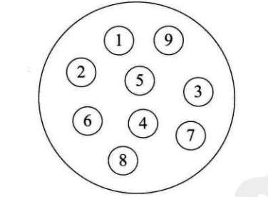
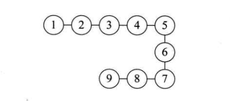
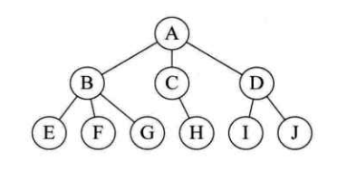
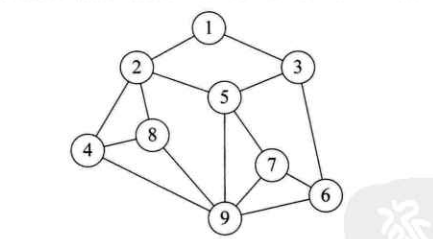
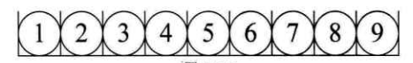

# 1. 数据结构绪论

## 1.1 数据结构起源

- 数据结构是一门研究非数值计算的程序设计问题的操作对象，以及它们之间的关系和操作等相关问题的学科。

&emsp;&emsp;1968年，美国的高德纳（Donald E.Knuth）教授在其所写的《计算机程序设计艺术》第一卷《基本算法》中，较系统地阐述了数据的逻辑结构和存储结构及其操作，开创了数据结构的课程体系。

- 数据结构在程序设计中的地位:

> 程序设计 = 数据结构 + 算法

## 1.2 基本概念和术语

1. <strong>数据</strong>：是描述客观事物的符号，是计算机中可以操作的对象，是能被计算机识别，并输入给计算机处理的符号集合。
2. <strong>数据元素</strong>:是组成数据的、有一定意义的基本单位，在计算机中通常作为整体处理，也被成为记录。
3. <strong>数据项</strong>：一个数据元素可以由若干个数据项组成。<strong>数据项是数据不可分割的最小单位</strong>。
4. <strong>数据对象</strong>：是性质相同的数据元素的集合，是数据的子集。
5. <strong>数据结构</strong>：是相互之间存在一种或多种特定关系的数据元素的集合。

## 1.3 逻辑结构与物理结构
&emsp;&emsp;按照视点的不同，我们把数据结构分为逻辑结构和物理结构。

### 1.3.1 逻辑结构

&emsp;&emsp;<strong>逻辑结构</strong>：是指数据对象中数据元素之间的相互关系。

- 集合结构：集合结构中的数据元素除了同属于一个集合外，它们之间没有其他关系。（如1.3.1图所示）

- 线性结构：线性结构总的数据元素之间是一对一的关系。（如图1.3.2所示）

- 树形结构：树形结构中的数据元素之间存在一种一对多的层次关系。（如图1.3.3所示）

- 图形结构：图形结构的数据元素是多对多的关系。（如图1.3.4所示）

&emsp;&emsp;在用示意图表示数据的逻辑结构时，需要注意两点：
1. 将每一个数据元素看做一个结点，用画圈表示。
2. 元素之间的逻辑关系用结点之间的连线表示，如果这个关系是有方向的，那么用带箭头的连线表示。

### 1.3.2 物理结构
&emsp;&emsp;<b>物理结构：是指数据的逻辑结构在计算机中的存储形式。</b>  
&emsp;&emsp;数据是数据元素的集合，那么根据物理结构的定义，实际上就是如何把数据元素存储到计算机的存储器中。存储器主要是针对内存而言的，像硬盘、软盘、光盘等外部存储器的数据组织通常常用文件结构来描述。  
&emsp;&emsp;数据的存储结构应正确反映数据元素之间的逻辑关系，这才是最为关键的，如何存储数据元素之间的逻辑关系，是实现物理结构的重点和难点。  
&emsp;&emsp;数据元素的存储结构形式有两种：顺序存储和链式存储。

- <b>顺序存储结构：是把数据元素存放在地址连续的存储单元里，其数据间的逻辑关系和物理关系是一致的（如图1.3.5所示）</b>。

- <b>链式存储结构：是把数据元素存放在任意的存储单元里，这组存储单元可以是连续的，也可以是不连续的</b>。

## 1.4 抽象数据类型

&emsp;&emsp;<b>抽象数据类型（Abstract Data Type, ADT）:是指一个数学模型及定义在该模型上的一组操作。“抽象”的意义在于数据类型的数学抽象特性。抽象数据类型体现了程序设计中问题分解、抽象和信息隐藏的特性。</b>

## 1.5 总结

&emsp;&emsp;作为一个菜鸟，这些概念是枯燥无味的。在每本书的开头，都会有这么一篇绪论，食之无味。但学习一门新的东西，总要走这一步。