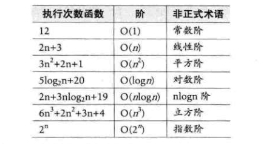

# 2. 算法

- 算法：<b>算法是解决特定问题求解步骤的描述，在计算机中表现为指令的有限序列，并且每条指令表示一个或多个操作</b>。

## 2.1 算法的特性

&emsp;&emsp;算法具有五个基本特性：输入、输出、有穷性、确定性和可行性。

- <b>输入</b>： 算法具有零个或多个输入。
- <b>输出</b>： 算法至少有一个或多个输出。
- <b>有穷性</b>：指算法在执行有限的步骤之后，自动结束而不会出现无限循环，并且每一个步骤在可接受的时间内完成。
- <b>确定性</b>：算法的每一步骤都具有确定的含义，不会出现二义性。
- <b>可行性</b>：算法的每一步都必须是可行的，也就是说，每一步都能够通过执行有限次数完成。

## 2.2 算法设计的要求

&emsp;&emsp;算法不是唯一的，同一个问题，可以有多种解决问题的算法。

### 2.2.1 正确性

&emsp;&emsp;<b>算法的正确性是指算法至少应该具有输入、输出和加工处理无歧义性、能够正确反映问题的需求、能够得到问题的正确答案</b>。&emsp;&emsp;但是算法的“正确”通常在用法上有很大的差别，大体分以下四个层次：

1. 算法程序没有语法错误
2. 算法程序对于合法的输入数据能够产生满足要求的输出结果
3. 算法程序对于非法的输入数据能够得出满足规格说明的结果
4. 算法程序对于精心选择的，甚至刁难的测试数据都有满足要求的输出结果

### 2.2.2 健壮性

&emsp;&emsp;<b>健壮性：当输入数据不合法时，算法也能做出相关处理，而不是产生异常或莫名其妙的结果。</b>

### 2.2.3 时间效率高和存储量低

&emsp;&emsp;<b>设计算法应该尽量满足时间效率高和存储量低的需求。</b>

## 2.3 算法效率的度量方法

- 事后统计方法：这种方法主要是通过设计好的测试程序和数据，利用计算机计时器对不同算法编制的程序的运行时间进行比较，从而确定算法效率的高低。（这种方法存在较大缺陷，不予采纳）
- 事前分析估算方法：在计算机程序编制前，依据统计方法对算法进行估算。

## 2.4 函数的渐近增长

&emsp;&emsp;输入规模n在没有限制的情况下，只要超出一个数值N，这个函数就总是大于另一个函数，我们称函数是渐近增长的。

> 函数的渐近增长：给定两个函数f(n)和g(n)，如果存在一个整数N，使得所有的n>N，f(n)总是比g(n)大，那么，我们说f(n)的增长渐近快于g(n)

&emsp;&emsp;判断一个算法的效率时，函数中的常数和其他次要项常常可以忽略，而应该关注主项（最高阶项）。

## 2.5 算法时间复杂度

### 2.5.1 算法时间复杂度定义

> 在进行算法分析时，语句总的执行次数T(n)是关于问题规模n的函数，进而分析T(n)随n的变化情况并确定T(n)的数量级。算法的时间复杂度，也就是算法的时间量度。记作T(n) = O(f(n))。它表示随问题规模n的增大，算法执行时间的增长率和f(n)的增长率相同，称作算法的渐近时间复杂度，简称时间复杂度。其中f(n)是问题规模n的过个函数。

### 2.5.2 推导大O阶方法

1. 用常数1取代运行时间中的所有加法常数。
2. 在修改后的运行次数函数中，只保留最高阶项。
3. 如果最高阶项存在且不是1，则去除与这个项相乘的常数。得到的结果就是大O阶。

### 2.5.3 常数阶

&emsp;&emsp;顺序结构的时间复杂度。下面这个算法：

```
int sum = 0,n =100;     /* 执行一次 */
sum = (1+n) * n/2;      /* 执行一次 */
printf("%d",sum);       /* 执行一次 */
```

&emsp;&emsp;这个算法的运行次数函数是f(n) = 3。根据推导大O阶的方法，第一步就是把常数项3改为1。没有最高项，所以这个算法的时间复杂度为O(1)。注意：不管常数是多少，都记作O(1)，而不能是O(3)、O(11)等。
&emsp;&emsp;对于分支结构而言，无论是真还是假，执行的次数都是恒定的，不会随着n的变大而发生变化。所以单纯的分支结构（不包含在循环结构中），其时间复杂度也是O(1)。

### 2.5.4 线性阶

&emsp;&emsp;线性阶的循环结构会复杂很多。要确定某个算法的阶次，需要确定某个特定语句或某个语句集运行的次数。故<b>分析算法的复杂度，关键就是要分析循环结构的运行情况</b>。下面这段代码的循环时间复杂度为O(n)，因为循环体中的代码必须要执行n次。

```
for (int i = 0; i < n;i++)
{
    /* 时间复杂度为O(1)的程序步骤序列 */
}
```

### 2.5.5 对数阶

```
int count = 1;
while (count < n)
{
    count = count * 2;
    /* 时间复杂度为O(1)的程序步骤序列 */
}
```

&emsp;&emsp;由于每次count乘以2之后，就距离n更近了一分。也就是说，有多少个2相乘后大于n就会退出循环。由$2^x=n$得到$\log_{2}{n}$。所以这个循环的时间复杂度为O($\log_{2}{n}$)。  

### 2.5.6 平方阶

&emsp;&emsp;下面例子是一个循环嵌套，他的内循环时间复杂度为O(n)。

```
for(int i = 0; i < n; i++)
{
    for(int j = 0; j < n; j++)
    {
        /* 时间复杂度为O(1)的程序步骤序列 */
    }
}
```
&emsp;&emsp;而对于外层的循环，不过是内部这个时间复杂度为O(n)的语句，再循环n次。所以这段代码的时间复杂度O($n^2$)。如果外循环的循环次数改为了m，时间复杂度就变成了O($mxn$)。  

### 2.5.7 常见的时间复杂度  



- 常见的时间复杂度所耗费的时间从小到大依次是：  

<p align=center>O(1) < O($log_{x}{n}$) < O(n$log_{x}{n}$) < O($n^2$) < O($n^3$) < O($2^n$) < O(n!) < O(n^n)</p>

### 2.5.8 最坏情况与平均情况  

&emsp;&emsp;最坏的情况运行时间是一种保证，那就是运行时间将不会再坏了。在应用中，这是一种最重要的需求，通常，除非特备指定，我们提到的运行时间都是最坏情况的运行时间。  
&emsp;&emsp;平均运行时间是所有情况中最有意义的，因为它是期望的运行时间。一般在没有特殊说明的情况下，都是指最坏时间复杂度。

## 2.6 算法空间复杂度  
&emsp;&emsp;算法的空间复杂度通过计算算法所需的存储空间实现，算法的空间复杂度的计算公式记作：$S(n) = O(f(n))$，其中，n 为问题的规模，f(n)为语句关于n所占存储空间的函数。  

## 2.7 总结  
&emsp;&emsp;本次认识到了许多基本概念，求导时间复杂度大O并不难，难的是对数列的一些相关运算，更多是数学知识和能力。果然，书到用时方恨少。