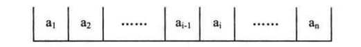
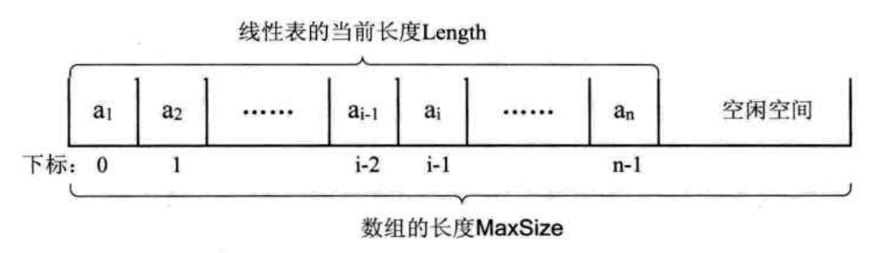
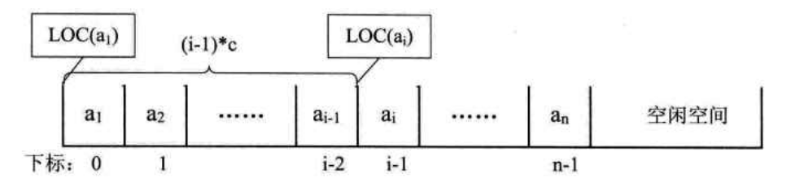
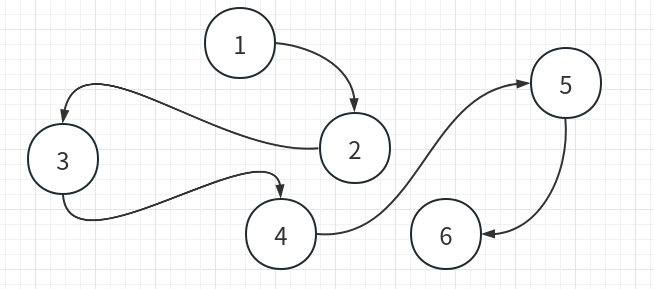
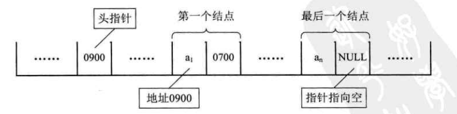
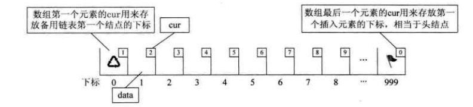
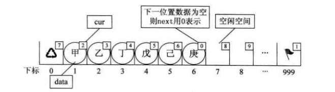
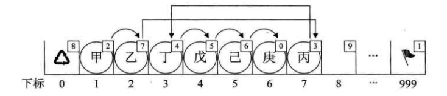
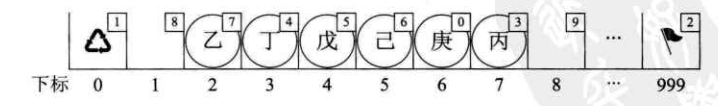
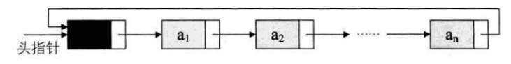

# 3. 线性表  

> 零个或多个数据元素的有限序列

## 3.1 线性表的定义  
- 线性表(List)：零个或多个数据元素的有限序列。  
- 数学定义：若将线性表记为(a~1~,...,a~i-1~,a~i~,a~i+1~,...,a~n~),则表中a~i-1~领先与a~i~，a~i~领先于a~i+1~，称a~i-1~是a~i~的直接前驱元素，a~i+1~是a~i~的直接后继元素。当i=1，2，...，n-1时，a~i~有且仅有一个直接后继，当i=2，3，...，n时，a~i~有且仅有有一个直接前驱。(如图3.1.1所示)

<div align=center></div>

- 所以线性表元素的个数n($n \geq 0$)定义为线性表的长度，当n = 0 时，称为空表。

&emsp;&emsp;在较复杂的线性表中，一个数据元素可以由若干个数据项组成。  

## 3.2 线性表的抽象数据类型  
 
ADT 线性表(List)  
Data   
&emsp;&emsp;线性表的数据对象集合为(a~1~,a~2~,...,a~n~)，每个元素的类型均为DataType。其中，除第一个元素a~1~外,每个元素有且只有一个直接前驱元素，除了最后一个元素a~n~外，每一个元素有且只有一个直接后继元素。数据元素之间的关系是一对一的关系  
Operation   
&emsp;&emsp;InitList(*L);初始化操作，建立一个空的线性表L   
&emsp;&emsp;ListEmpty(L);若线性表为空，返回ture,否则返回false   
&emsp;&emsp;ClearList(*L);将线性表清空   
&emsp;&emsp;GetElem(L,i,*e);将线性表L中的第i个元素值返回给e   
&emsp;&emsp;LocateElem(L,e);在线性表L中查找与给定值e相等的元素，如果查找成功，返回该元素在表中序号表示成功；否则，返回0表示失败。   
&emsp;&emsp;ListInsert(*L,i,e);在线性表L中的第i个位置插入新元素e  
&emsp;&emsp;ListDelete(*L,i,*e);删除线性表L中第i个位置元素，并用e返回其值  
&emsp;&emsp;ListLength(L);返回线性表L的元素个数  
endADT

- 实现两个线性表A和B的并集操作

```
/* 将所有的在线性表Lb中但不在La中的数据元素插入到La中 */

void union(List *La, List Lb)
{
  int La_len,Lb_len,i;
  ElemType e;                       /* 声明与La和Lb相同的数据元素e */
  La_len = ListLength(La);          /* 求线性表的长度 */
  Lb_len = ListLength(Lb);      
  for (i = 1; i <= Lb_len; i++)
  {
    GetElem(Lb,i,e);                /* 取Lb中第i个数据元素献给e */
    if(!LocateElem(La,e,equal))     /* La中不存在和e相同数据元素 */
    {
      ListInsert(La,++La_len,e);    /* 插入 */
    }
  }
}
```

## 3.3 线性表的顺序存储结构

### 3.3.1 顺序存储定义  

> 线性表的顺序存储结构，指的是用一段地址连续的存储单元依次存储线性表的数据元素。

&esmp;&emsp;线性表（a~1~,a~2~,...,a~n~）的顺序存储示意图如下：  
<div align=center></div>

### 3.3.2 顺序存储方式  
&emsp;&emsp;<font color=red>使用一维数组实现存储结构</font>

- 线性表的顺序存储的结构代码

```
#define MAX_SIZE 20              /* 存储空间初始分配量 */
typedef int ElemType            /* ElemType类型根据实际情况而定，这里假设为int */

typedef struct 
{
    ElemType data[MAX_SIZE];     /* 数据存储数据元素，最大值为MAXSIZE */
    int length;                 /* 线性表当前长度 */
}SqList;

```
&emsp;&emsp;描述顺序存储结构需要三个属性：  
- 存储空间的起始位置：数组data，它的存储位置就是存储空间的存储位置。  
- 线性表的最大存储容量：数组长度MaxSize  
- 线性表的当前长度:length

### 3.3.3 地址计算方法  
&emsp;&emsp;C语言的数组是从0开始第一个下标的，于是线性表的第i个元素是要存储在数组下标为i-1的位置，即数组元素的序号和存放它的数组小白哦之间存在对应关系。（如图3.3.3所示）  

<div align=center></div>  

&emsp;&emsp;<b>存储器中的每个存储单元都有自己的编号，这个编号称为地址。</b>  

&emsp;&emsp;假设占用的是c个存储单元，那么线性表中第i+1的数据元素的存储位置和第i个数据元素的存储位置满足下列关系(LOC表示获得存储位置的函数)。  

&emsp;&emsp;LOC(a~i+1~) = LOC(a~i~) + c  
&emsp;&emsp;所以对于第i个数据元素a~i~的存储位置可以由a~1~推算而出：  
&emsp;&emsp;LOC(a~i~) = LOC(a~i~) + (i-1)*c  从下图3.3.4所示：  

<div align=center></div>  


&emsp;&emsp;通过这个公式，我们可以随时算出线性表中任意位置的地址，不管它是第一个还是最后一个，都是相同的时间。它的存取时间性能为O(1)。  

## 3.4 顺序存储结构的增删改查    


### 3.4.1  插入操作(增)

&emsp;&emsp;插入算法的思路：

- 如果插入位置不合理，抛出异常；
- 如果线性表长度大于数组长度，则抛出异常或动态增加容量;
- 从最后一个元素开始向前遍历到第i个位置，分别将它们都向后移动一个位置；
- 将要插入元素填入位置i处;
- 表长加1

```
/* 初始条件：顺序线性表L已存在，1<= i <= ListLength(L) */
/* 操作结果：在L中第i个位置之前插入新的数据元素e，L的长度加1 */

Status ListInsert(SqList *L ,int i, ElemType e)
{
    int k;
    
    if(L->length == MAX_SIZE) /* 顺序线性表已经满 */ 
    {
        return ERROR;
    }
    
    if(i < 1 || i > L->length+1) /* 当i不在范围时 */
    {
        return ERROR;
    }
    
    if( i <= L->length) /* 若插入数据位置不在表尾 */
    {
        for(k=L->length-1; k>= i-1; k--) /* 将要插入位置后数据元素向后移动一位 */
        {
            L->data[k+1] = L->data[k];
        }
    }
    
    L->data[i-1] = e; /* 将新元素插入 */
    L->length++;
    return OK;
}
```

### 3.4.2 删除操作(删)

&emsp;&emsp;删除算法的思路  

- 如果删除位置不合理，抛出异常；
- 取出删除元素；
- 从删除元素位置开始遍历到最后一个元素位置，分别将它们都向前移动一个位置;
- 表长减1

```
/* 初始条件：顺序线性表L已存在，1<= i <= ListLength(L) */
/* 操作结果：删除L的第i个数据元素，并用e返回其值，L的长度减1 */

Status ListDelete(SqList *L,int i, ElemType *e)
{
    int k;
    if(L->length == 0) /* 线性表为空 */
    {
        return ERROR;
    }
    
    if (i < 1 || i > L->length) /* 删除位置不正确 */
    {
        return ERROR;
    }
    
    *e = L->data[i-1];
    
    if (i < L->length) /* 如果删除不是最后位置 */
    {
        for(k=i;k < L->length;k++) /* 将删除位置后继元素前移 */
        {
            L->data[k-1] = L->data[k];
        }
    }
    
    L->length--;
    return OK;
}
```
&emsp;&emsp;分析一下插入和删除的时间复杂度。最好情况，如果插入到最后一个位置，或者删除最后一个元素，此时时间复杂度为O(1)。最坏情况，插入或删除第一个元素，此时时间复杂度为O(n)。平均情况，由于元素插入到第i个位置，或删除第i个元素，需要移动n-i个元素。根据概率原理，每个位置插入或删除元素的可能性是相同的，也就是说位置靠前，移动元素多，位置靠后，移动元素少。最终平均移动次数和最中间的那个元素的移动次数相等，为(n-1)/2。  
&emsp;&emsp;最终我们得出，平均时间复杂度为O(n)。线性表的顺序存储结构，在存、读数据时，不管是那个位置，时间复杂度都是O(1)；而插入或删除时，时间复杂度为O(n)。

### 3.4.3 修改元素(改)  

```

Status GetElem(SqList L ,int i, ElemTYpe *e)
{
    if(L.length == 0 || i<1 || i>L.length)
    {
        return ERROR;
    }
    L.data[i-1] = e;//修改第i个元素
    return OK;
}
```

### 3.4.4 获得元素(查)
&emsp;&emsp;对于线性表的顺序存储结构来说，如果我们要实现GetElem的操作，即将线性表L中的第i个位置元素指返回，只要i的数值在数组下标范围内，就是吧数组第i-1下标的值返回即可。  
```
#define OK 1
#define ERROR 0
#define TRUE 1
#define FALSE 0

typeded int Status;

/* Status是函数的类型吗，其值是函数结果状态代码，如OK等 */
/* 初始条件：顺序线性表L已存在，1 <= i <= ListLength(L) */
/* 操作结果：用e返回L中第i个数据元素的值 */

Status GetElem(SqList L ,int i, ElemTYpe *e)
{
    if(L.length == 0 || i<1 || i>L.length)
    {
        return ERROR;
    }
    
    *e = L.data[i-1];
    return OK;
}

```  

### 3.4.5 线性表顺序存储结构的优缺点  
优点

- 无须为表示表中元素之间的逻辑关系而增加额外的存储空间
- 可以快速第存取表中任一位置的元素

缺点

- 插入和删除操作需要移动大量元素
- 当线性表长度变化较大时，难以确定存储空间的容量
- 造成存储空间的“碎片”

## 3.5 线性表的链式存储结构  

### 3.5.1 线性表链式存储结构定义  
&emsp;&emsp;线性表的链式存储结构的特点是用一组任意的存储单元存储线性表的数据元素，这组存储单元可以是连续的，也可以是不连续的。这就意味着，这些数据元素可以存在内存未被占用的任意位置（如图3.5.1所示）。  

<div align="center"></div>  

&emsp;&emsp;<b>为了表示每个数据元素a~i~与其直接后继数据元素a~i+1~之间的逻辑关系，对数据元素a~i~来说，除了存储其本身的信息之外，还需要存储一个指示其直接后继的信息（即直接后继的存储位置）。我们把存储数据元素信息的域称为数据域，把存储直接后域位置的域称为指针域。指针域中存储的信息称作指针或链。这两部分信息组成数据元素a~i~的存储映像，称为<font color=red>结点(Node)</font>。</b>  
&emsp;&emsp;<b>n个结点(a~i~的存储映像)链结成一个链表，即为线性表(a~1~,a~2~,...,a~n~)的链式存储结构，因为此链表的每个结点中只包含一个指针域，所以叫做单链表</b>。  

<div align="center"></div>  

&emsp;&emsp;在单链表的第一个结点前附设一个结点，称为<font color=red>头结点</font>。  

- 头结点和头指针的异同  
  - 头指针  
    - 头指针是指链表向第一个结点的指针，若链表有头结点，则是指向头结点的指针
    - 头指针具有标识作用，所以常常用头指针冠以链表的名字  
    - 不论链表是否为空，头指针均不为空。头指针是链表的必要元素  
  - 头结点
    - 头结点是为了操作的统一和方便而设立的，放在第一元素的结点之前，其数据域一般无意义（也可存放链表的长度）  
    - 有了头结点，对在第一元素结点前插入结点和删除第一结点，其操作与其它结点的操作就统一了  
    - 头结点不一定是链表必须要素

```
/* 线性表的单链表存储结构 */
typedef struct Node
{
    ElemType data;
    struct Node *next;
} Node;
typedef struct Node *LinkList; /* 定义LinkList */
```  

&emsp;&emsp;结点由存放数据元素的数据域、存放后继结点地址的指针域组成。  

## 3.6 单链表的读取  
&emsp;&emsp;获取链表第i个数据的算法思路：  
1. 声明一个结点P指向链表第一个结点，初始化j从1开始；
2. 当j<i时，就遍历链表，让p的指针向后移动，不断指向下一结点，j累加1；
3. 若到链表末尾p为空，则说明第i个元素不存在；
4. 否则查找成功，返回结点p的数据

```
/* 初始条件：顺序线性表L已存在,1<=i<=ListLength(L) */
/* 操作结果：用e返回L中第i个数据元素的值 */

Status GetElem(LinkList L,int i,ElemType *e)
{
  int j;
  LinkList p;         /* 声明工作指针p */
  p = L->next;        /* 让p指向链表L的第一个结点 */
  j = 1;              /* j为计数器 */
  while(p && j<i)     /* p不为空或者计数器j还没有等于i时，循环继续 */
  {
    p = p->next;      /* 让p指向下一个结点 */
    ++j;
  }  
  if(!p || j>i)
  {
    return ERROR;     /* 第i个元素不存在 */
  }
  
  *e = p->data;       /* 获取第i个元素的数据 */
  
  return OK;
}
```

&emsp;&emsp;核心思想就是“工作指针后移”，最坏的时间复杂度是O(n)。

--- 

## 3.7 单链表的插入与删除  

### 3.7.1 单链表的插入

&emsp;&emsp;单链表第i个数据插入结点的算法思路：  
1. 声明一结点p指向链表第一个结点，初始化j从1开始；
2. 当j<i时，就遍历链表，让p的指针向后移动，不断指向下结点，j累加1；
3. 若到链表末尾p为空，则说明第i个元素不存在;
4. 否则查找成功，在系统中生成一个空结点s;
5. 将数据元素e赋值给s->data;
6. 单链表的插入标准语句 s->next=p->next;p->next=s
7. 返回成功

```
/* 初始条件:顺序线性表L已存在，1<= i <= ListLength(L) */
/* 操作结果：在L中第i个位置之前插入新的数据元素e，L的长度加1 */
Status ListInsert(LinkList *L ,i , ElemType e)
{
  int j;
  LinkList p,s;
  p = *L;
  j = 1;
  
  while(p && j<1)                                         /* 寻找第i个结点 */
  {
    p = p->next;
    ++j;
  }
  
  if(!p || j>i)
  {
    return ERROR;                                         /* 第i个元素不存在 */
  }
  
  s = (LinkList) malloc(sizeof(Node));                    /* 生成新结点(C标准函数) */
  s->data = e;
  s->next = p->next;                                      /* 将p的后继结点赋值给s的后继 */
  p->next = s;                                            /* 将s赋值给p的后继 */
  return OK;
}
```

### 3.7.2 单链表的删除  

&emsp;&emsp;单链表第i个数据删除结点的算法思路：  
1. 声明一结点p指向链表第一个结点，初始化j从1开始；
2. 当j<i时，就遍历链表，让p的指针向后移动，不断指向下一个结点，j累加1
3. 若到链表末尾p为空，则说明第i个元素不存在；
4. 否则查找成功，将欲删除的结点p->next赋值给q
5. 单链表的删除标准语句p->next=q->next;
6. 将q结点中的数数据赋值给e,作为返回
7. 释放q结点
8. 返回成功

```
/* 初始条件：顺序线性表L已存在，i<=i<=ListLength(L) */
/* 操作结果：删除L中的第i个数据元素，并用e返回其值，L的长度渐1 */  
Status ListDelete(LinkList *L, int i,ElemType *e)
{
  int j;
  LinkList p,q;
  p = *L;
  j = 1;
  
  while(p->next && j<i)         /* 遍历寻找第i个元素 */
  {
    p = p->next;
    ++j;
  }
  
  if(!(p->next) || j>i)
  {
    return ERROR;              /* 第i个元素不存在 */
  }
  q = p->next;                
  p = next = q->next;          /* 将q的后继赋值给p的后继 */
  *e = q->data;                /* 将q结点中的数据给e */
  free(q);                     /* 让系统回收此结点，释放内存 */
  return OK;
} 
```

&emsp;&emsp;从整个算法来说，它们的时间复杂度都是O(n)。如果不知道第i个元素的指针位置，单链表数据结构在插入和删除操作上，与线性表的顺序存储结构是没有太大的优势的。但是，如果从第i个位置插入10个元素，对于顺序存储结构而言，每一次插入都需要移动n-i个元素，每次都是O(n)。而对于单链表，我们只需要在第一次时，找到第i个位置的指针，此时为O(n)，接下来只是简单地通过赋值移动指针而已，时间复杂度都是O(1)。显然，对于插入或删除数据越频繁的操作，单链表的效率优势就越是明显。  

## 3.8 单链表的整表创建  
&emsp;&emsp;单链表整表创建的算法思路：  
1. 声明一结点p和计数器变量i  
2. 初始化一空链表L
3. 让L的头结点的指针指向NULL，则建立一个带头结点的单链表
4. 循环：
  - 生成一新结点赋值给p
  - 随机生成一数字赋值给p的数据域p->data
  - 将p插入到头结点与前一新结点之间

- 头插法  
```
/* 随机产生n个元素的值，建立带表头结点的单链线性表L(头插法) */  
void CrerateListHead(LinkList *L ,int n)
{
  LinkList p;
  int i;
  srand(time(0));                     /* 初始化随机粒子 */
  *L = (LinkList) malloc(sizeof(Node));
  (*L)->next = NULL;                  /* 先建立一个带头结点的单链表 */  
  for(i=0;i<n;i++)
  {
    p = (LinkList)malloc(sizeof(Node));/* 生成新结点 */
    p->data = rand()%100+1;            /* 随机生成100以内的数字 */
    p->next = (*L)->next;
    (*L)->next = p;                   /* 插入到表头 */
  }
}
```  

- 尾插法  

```
/* 随机产生n个元素的值，建立带表头结点的单链线性表L(尾插法) */
void CreateListTail(LinkList *L,int n)
{
  LinkList p,r;
  int i;
  srand(time(0));                     /* 初始化随机数种子 */
  *L = (LinkList)malloc(sizeof(Node));/* 为整个线性表 */
  r = *L;
  for(i = 0; i < n; i++)
  {
    p = (Node*)malloc(sizeof(Node));  /*生成新结点*/
    p->data = rand() %100 + 1;        /*随机成成100以内的数字*/
    r->next = p;                      /*将表尾终端结点的指针指向新结点*/
    r = p;                            /*将当前的新节点定义为表尾终端结点*/
  }
  
  r->next = NULL;                     /*表示当前链表结束*/
}
```

## 3.9 单链表的整表删除  
&emsp;&emsp;单链表整表删除的算法思路如下：  
1. 声明一结点p和q
2. 将第一个结点赋值给p
3. 循环  
   - 将下一结点赋值给q
   - 释放p
   - 将q赋值给p

```
/*初始条件：顺序线性表已存在*/
/*操作结果：将L重置为空表*/

Status ClearList(LinkList *L)
{
  LinkLIst p,q;
  p = (*L)->next;     /*p指向第一个结点*/
  while(p)
  {
    q=p->next;
    free(p);
    p=q;
  }
  (*L)->next = NULL;   /*头结点指针域为空*/
  return OK;
}
```

## 3.10 单链表结构与顺序 

- 存储分配方式
  - 顺序存储结构用一段连续的存储单元依次存储线性表的数据元素
  - 单链表采用链式存储结构，用一组任意的存储单元存放线性表的元素
- 时间性能
  - 查找
    - 顺序存储结构O(1)
    - 单链表O(n)
  - 插入和删除
    - 顺序存储结构需要平均移动表长一半的元素，时间为O(n)
    - 单链表在线出某位置的指针后，插入和删除时间仅为O(1)
- 空间性能
  - 顺序存储结构需要预分配存储空间，分大了，浪费。分小了易发生上溢
  - 单链表不需要分配空间，只要有就可以分配，元素个数也不受限制

&emsp;&emsp;通过上面的对比，可以得出一些经验性的结论：  
- 若线性表需要频繁查找，很少进行插入和删除操作时，宜采用顺序存储结构。若需要频繁查找，很少进行插入和删除操作时，宜采用顺序存储结构。若需要频繁插入和删除时，宜采用单链表结构。比如说游戏开发中，对于用户注册的个人信息，除了注册时插入数据外，绝大数情况都是读取，所以应该考虑用顺序存储结构。而游戏中的玩家的武器或者装备列表，随着玩家的游戏过程中，可能会随时增加或删除，此时再用顺序存储就不太合适了，这只是简单的类比，实际开发，考虑的问题会复杂得多。  
- 当线性表中的元素个数变化较大或者根本不知道有多大时，最好用单链表结构，这样可以不需要存储空间的大小问题。而如果事先知道线性表的大致长度，比如一年12个月，一周就是星期一至星期日共七天，这种用顺序存储结构效率会高很多。  

## 3.11 静态链表  
&emsp;&emsp;让数组的元素都是由两个数据域组成，data和cur。也就是说，数组的每个下标都对应一个data和一个cur。数据域data，用来存放数据元素，也就是通常要处理的数据；而游标cur相当于单链表中的next指针，存放该元素的后继在数组中的下标。这种用数组描述的链表叫做<b>静态链表</b>。  

```
/*线性表的静态链表存储结构*/
/*静态链表实际上就是一个结构体数组*/
#define MAX_SIZE 1000  /* 假设链表的最大长度是1000 */
typedef struct
{
  ElemType data;
  int cur;            /* 游标(Cursor)，为0时表示无指向 */

} Component,StaticLinkList[MAX_SIZE];
```
&emsp;&emsp;另外我们对数组第一个和最后一个元素作为特殊元素处理，不存数据。我们通常把未使用的数组元素称为备用链表，而数组第一个元素，即下标为0的元素的cur就存放备用链表的第一个结点的下标；而数组的最后一个元素的cur则存放第一个数值的元素的下标，相当于单链表中的头结点作用，当整个链表为空时，则为0。如图3.11.1所示：  

<div align="center"></div>

```
/*将一维数组space中各分量链成——备用链表*/
/*space[0].cur为头指针，"0"表示空指针*/
Status InitList(StaticLinkList space)
{
  int i;
  for(i=0;i<MAX_SIZE-1;i++)
  {
    space[i].cur = i+1;
  }
  space[MAX_SIZE-1].cur = 0; /*目前静态链表为空，最后一个元素的cur为0*/
  return OK;
}
```
&emsp;&emsp;假设我们已经将数据存入静态链表，比如分别存放着“甲”、“乙”、“丁”、“戊”、“已”、“庚”等数据，则它处于图3.11.2所示：  

<div align="center"></div> 

&emsp;&emsp;此时“甲”这里就存有下一个元素“乙”的游标2，“乙”则存有下一个元素“丁”的下标3.而“庚”是最后一个有值元素，所以它的curr设置为0。而最后一个元素的cur则因“甲”是第一有值元素而存有它的下标为1.而第一个元素则因空闲空间的第一个元素下标为7，所以它的cur存有7。  

### 3.11.1 静态链表的插入操作  
&emsp;&emsp;静态链表中要解决的是：如何用静态模拟动态链表结构的存储空间的分配，需要是申请，无用时释放。在动态链表中，结点的申请和释放分别借用malloc()和free()两个函数来实现。在静态链表中，操作的是数组，不存在像动态链表的结点申请和释放问题，所以我们需要自己实现这两个函数，才可以做插入和删除的操作。  
&emsp;&emsp;为了辨明数组中哪些分量未被使用，解决的办法是将所有未被使用过的及已被删除的分量用游标链成一个备用的链表，每当进行插入时，便可以从备用链表上取得第一个结点作为待插入的新结点。  

```
/*若备用空间链表非空，则返回分配的结点下标，否则返回0*/
int Malloc_SLL(StaticLinkList space)
{
  int i = space[0].cur;                   /*当前数组第一个元素的cur存的值，就是要返回的第一个备用空间的下标*/
  
  if(space[0].cur)
  {
    space[0].cur = space[i].cur;          /*由于要拿出一个分量来使用了，所以就得把它的下一分量用来做备用*/
  }
  return i;
}
```

&emsp;&emsp;这段代码一方面它的作用就是返回一个下标之，这个值就是数组头元素的cur存的第一个空闲的下标。从上面的图示例子来看，其实就是返回7。  
&emsp;&emsp;既然下标为7的分量准备要使用了，就得有接替者，所以就把分量7的cur值赋值给头元素，也就是把8给space[0].cur，之后就可以继续分配新的空闲分量，实现类似malloc()函数的作用。  
&emsp;&emsp;现在如果需要在“乙”和“丁”之间，插入一个值为“丙”的元素，按照以前顺序结构的做法，应该要把“丁”、“戊”、“已”、“庚”这些元素都往后移一位。但静态链表就不需要了。  

```
/* 在L中第i个元素之前插入新的数据元素e */
Status ListInsert(StaticLinkList L, int i,ElemType e)
{
  int j,k,l;
  k = MAX_SIZE - 1;                        /*注意k首先是最后一个元素的下标*/
  if(i<1 || i> ListLength(L) + 1)
  {
    return ERROR;
  } 
  
  j = Malloc_SSL(L);                     /*获得空闲分量的下标*/
  
  if(j)
  {
    L[j].data = e;                        /*将数据赋值给此分量的data*/
    for(l=1; l<= i-1; l++)                /*找到第i个元素之前的位置*/
    {
      k = L[k].curr;
    }
    L[j].cur = L[k].cur;                  /*把第i个元素之前的cur赋值给新元素的cur*/
    L[k].cur = j;                         /*把新元素的下标赋值给第i个元素之前元素的cur*/
    return OK;
  }
  
  return ERROR;
 }
```

- 当我们执行语句时，我们的目的是要在“乙”和“丁”之间插入“丙”。调用代码时，输入i值为3。  
- 然后让k = MAX_SIZE - 1 = 999。
- j = Malloc_SSL(L) = 7。此时下标为0的cur也因为7要被占用而更改备用链表的值为8。
- 第一次for循环是由1到2，执行两次。代码k=L[k].cur；使得k=999,得到k=L[999].cur=1,再得到k=L[1].cur=2
- L[j].cur=L[k].cur,因j=7，而k=2得到L[7].cur=L[2].cur=3。这就是刚才说的让"丙”把它的cur改为3的意思。  
- L[k].cur = j;意思就是说L[2].cur=7,也就是让“乙”的cur改为指向“丙”的下标7。  

&emsp;&emsp;就这样，我们实现了在数组中，实现不移动元素，却插入了数据的操作（如图3.11.3所示）  

<div align="center"></div>

### 3.11.2 静态链表的删除操作

```
/*删除在L中第i个数据元素e*/
Status ListDelete(StaticLinkList L,int i)
{
  int j,k;
  if(i<1 || i>ListLength(L))
  {
    return ERROR;
  }
  k = MAX_SIZE - 1;
  for(j =1; j<=i-1;j++)
  {
    k = L[k].cur;
  }
  
  j = L[k].cur;
  L[k].cur = L[j].cur;
  Free_SSL(L,j);
  return OK;
}
```

&emsp;&emsp;有了刚才的基础，这段代码就很容易理解了。前面代码都一样，for循环因为i=1而不操作，j=k[999].cur=1,L[k].cur=L[j].cur也就是L[999].cur=L[1].cur=2。这其实就是告诉计算机现在“甲”已经离开了，“乙”才是第一个元素。Free_SSL(L,j)；

```
/*将下标为k的空闲结点回收到备用链表*/
void Free_SSL(StaticLinkList space, int k)
{
  space[k].cur = space[0].cur;  /*把第一个元素cur值赋给要删除的分量cur*/
  space[0].cur = k;             /*把要删除的分量下标赋值给第一个元素的cur*/
}
```

&emsp;&emsp;意思就是“甲”现在要走，这个位置就空出来了，也就是，未来如果有新人来，最优先考虑这里，所以原来的第一个空位分量，即下标是8的分量，它降级了，把8给“甲”所在下标为1的分量的cur，也就是space[1].cur=space[0].cur=8，而space[0].cur=k=1，其实就是让这个删除的位置称为第一个优先空位，把它存入第一个元素的cur中，如图3.11.4所示  

<div align="center"></div>  

```
/*初始条件，静态链表L已存在。操作结果：返回L中数据元素个数*/

int ListLength(StaticLinkList L)
{
  int j=0;
  int i=L[MAX_SIZE-1].cur;
  while(i)
  {
    i=L[i].cur;
    j++;
  }
  return j;
}
```

### 3.11.3 静态链表优缺点

- 优点
  - 在插入和删除操作时，只需要修改游标，不需要移动元素，从而改进了在顺序存储结构中的插入和删除操作需要移动大量元素的缺点
- 缺点
  - 没有解决连续存储分配带来的表长难以确定的问题  
  - 失去了顺序存储结构随机读取的特性

## 3.12 循环链表  

&emsp;&emsp;<b>将单链表中终端结点的指针端由空指针改为指向头结点，就使整个单链表形成一个环，这种头尾相接的单链表称为单循环链表，简称<font color=red>循环链表（circular linked list）</font></b>。如图3.12.1所示  

<div align="center"></div>

&emsp;&emsp;循环链表的单链表的主要差异就在于循环的判断条件上，原来是判断p->next不等于头结点，则循环未结束。  


## 3.13 双向链表  

&emsp;&emsp;<b>双向链表(double linked list)是在单链表的每个结点中，再设置一个指向其前驱结点的指针域</b>。

```
/*线性表的双向链表存储结构*/
typedef strcut DulNode
{
  ElemTyped data;
  struct DulNode *prior;      /*直接前驱指针*/
  struct DulNode *next;       /*直接后继指针*/
}DulNode,*DuLinkList;
```

&emsp;&emsp;双向链表是单链表中扩展出来的结构，很多操作和单链表相同的。既然单链表也可以有循环链表，那么双向链表也可以是循环表。双向链表既然是比单链表多了如可以反向遍历查找等数据结构，但是插入和删除时，需要更改两个指针变量。  

## 3.14 总结  
&emsp;&emsp;想享乐就得先努力，欲收获就得付出代价。舒适环境是很难培养出坚强品格，被安排好的人生，也很难做出伟大事业。