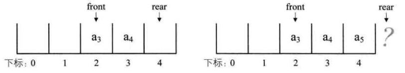

# 4 栈与队列  

&emsp;&emsp;<b>栈是限定仅在表尾进行插入和删除操作的线性表。队列是只允许在一端进行插入操作、而在另一端进行删除操作的线性表。</b>  

## 4.1 栈的定义  

> <b>栈(stack)是限定仅在表尾进行插入和删除操作的线性表。</b>

&emsp;&emsp;我们把允许插入和删除的一端称为栈顶(top)，另一端称为栈底(bottom)，不含任何数据元素的栈称为空栈。栈又称为后进先出(Last In First Out)的线性表，简称LIFO结构。  
&emsp;&emsp;栈的插入操作，叫作进栈，也称压栈、入栈。  
&emsp;&emsp;栈的删除操作，叫作出栈，也称弹栈。  

### 4.1.1 进栈出栈变化形式  
&emsp;&emsp;如果现在有3个整型数字元素1、2、3依次进栈，会有那些出栈次序？  
- 第一种：1进、2进、3进，3出、2出、1出
- 第二种：1进、1出，2进、2出，3进、3出
- 第三种：1进、2进、2出、1出，3进、3出
- 第四种：1进、2进、2出、3进，3出、1出
- 第五种：1进、1出，2进、3进，3出、2出

## 4.2 栈的抽象数据类型  

```
ADT 栈(stack)

Data 
    同线性表。元素具有相同的类型，相邻元素具有前驱和后继元素。 
Operation
    InitStack(*S):初始化操作，建立一个空栈S
    DestotyStack(*S):若栈存在，则销毁它
    ClearStack(*S):将栈清空
    StackEmpty(*S):若栈存在且非空，用e返回S的栈顶元素
    GetTop(S,*e):若栈存在且非空，用e返回S的栈顶元素
    Push(*S,e):若栈S存在，插入新元素e到栈S中并称为栈顶元素。  
    Pop(*S,*e):删除栈S中栈顶元素，并用e返回其值
    StackLength(S):返回栈S的元素个数    
endADT
```

## 4.3 栈的顺序存储结构及实现

### 4.3.1 栈的顺序存储结构  
&emsp;&emsp;栈的结构定义
```
typedef int SElemType;      /*SElmType类似根据实际情况而定，这里假设为int*/
typedef strcut
{
    SElemType data[MAX_SIZE];
    int top;                /*用于栈顶指针*/
}SqStack;
```
### 4.3.2 栈的顺序存储结构——进栈操作  
```
/*插入元素e为新的栈顶元素*/
Status Push(SqStack *S,SElemType e)
{
    if(S->top == MAX_SIZE-1 )   /*栈满*/
    {
        return ERROR;
    }
    S->top++;                   /*栈顶指针增加一*/
    S->data[S->top] = e;        /*将新输入元素赋值给栈顶空间*/
    return OK;
}
```
### 4.3.3 栈的顺序存储结构——出栈操作
```
/*若栈不空，则删除S的栈顶元素，用e返回其值，并返回OK;否则返回ERROR*/
Status Pop(SqStack *S, SElemType *e)
{
    if(S->top == -1)
    {
        return ERROR;
    }
    *e = S->data[S->top];           /*将要删除的栈顶元素赋值给e*/
    S->top--;                       /*栈顶指针减一*/
    return OK;
}
```

### 4.4 两栈共享空间  
&emsp;&emsp;如图4.4.1所示，数组有两个端点，两个栈有两个栈底，让一个栈的栈底为数组的始端，即下标为0处，另一个栈为栈的末端，即下标为数组长度n-1处。这样，两个栈如果增加元素，就是两端点向中间延伸。 
<div align="center"></div>  
&emsp;&emsp;其实关键思路：它们是在数组的两端，向中间靠拢。top!和top2是栈1和栈2的栈顶指针，栈1为空时，就是top1等于-1时；而当top2等于n时，即是栈2为空。若栈2是空栈，栈1的top1等于n-1时，就是栈1满了，当栈1位空栈时，top2等于0时，为栈2满。其实就是两个指针之间相差1时，即top1+1 == top2为栈满。两栈共享空间的结构代码如下：  

```
typedef struct
{
    SElemType data[MAX_SIZE];
    int top1;                   /*栈1栈顶指针*/
    int top2;                   /*栈2栈顶指针*/
}SqDoubleStack;
```

&emsp;&emsp;对于两栈共享空间的push方法，除了要插入元素值参数外，还需要一个判断是栈1还是栈2的栈号参数stackNumber。  

```
/*插入元素e为新的栈顶元素*/
Status Push(SqDoubleStack *S, SElemType e, int stackNumber)
{
    if(S->top1+1 == S->top2)            /*栈已满，不能再push新元素*/
    {
        return ERROR;
    }
    
    if (stackNumber == 1)               /*栈1有元素进栈*/
    {
        S->data[++S->top1] = e;         /*若栈1则先top1+1后给数组元素赋值*/
    }else if(stackNumber == 2)          /*栈2有元素进栈*/
    {
        S->data[--S->top2] = e;         /*若栈2则先top2-1后给数组元素赋值*/
    }
    
    return OK;
}
```
&emsp;&emsp;因为在开始已经判断了是否有栈满的情况，所以后面的top1+1或top2-1是不担心溢出问题的。对于两栈共享空间的pop方法，参数就只是判断栈1栈2的参数stackNumber：  
```
/*若栈不空，则删除S的栈顶元素，用w返回其值，并返回OK;否则返回ERROR*/
Status Pop(SqDoubleStack *S, SElemType *e, int stackNumber)
{
    if(stackNumber == 1)
    {
        if(S->top1 == -1)
        {
            return ERROR;           /*说明栈1已经是空栈，溢出*/
        }
        *e = S->data[S->top1--];    /*将栈1的栈顶元素出栈*/
    }else if (stackNumber == 2)
    {
        if(S->top2 == MAX_SIZE)
        {
            return ERROR;           /*说明栈2已经是空栈，溢出*/
        }
        *e = S->data[S->top2++];    /*将栈2的栈顶元素出栈*/
    }
    return OK;
}
```

&emsp;&emsp;事实上，使用这样的数据结构，通常都是两个栈的空间需求有相反关系时，也就是一个栈增长时另一个栈在缩短的情况。就像买卖股票一样，你买入时，一定是有一个你不知道的人在做卖出操作。有人赚钱，就一定是有赔钱。这样使用两栈共享空间存储方法才有比较大的意义。否则两个栈都在不停地增长，那很快就会因栈满而溢出了。当然，这只是针对两个具有相同数据类型的栈的一个设计上的技巧，如果是不相同数据类型的栈，这种办法不但不能更好地处理问题。  

## 4.4 栈的链式存储结构及实现  

### 4.4.1 栈的链式存储结构  
&emsp;&emsp;<b>栈的链式存储结构，简称为链栈</b>。已经有了栈顶在头部了，单链表中比较常用的头结点也就失去了意义，通常对于恋战来说，是不需要头结点的。对于链栈来说，基本不存在栈满的情况，除非内存已经没有可以使用的空间。但对于空栈来说，链表原定义是头指针指向空，那么链栈的空其实就是top=NULL的时候。链栈的结构代码如下：  
```
typedef struct StackNode
{
    SElemType data;
    struct StackNode *next;
}StackNode,*LinkStackPtr;
typedef struct LInkStack
{
    LinkStackPtr top;
    int count;
}LinkStack;
```

### 4.4.2 栈的链式存储结构——进栈操作  

```
/*插入元素e为新的栈顶元素*/
Status Push(LinkStack *S, SElemType e){
    LinkStackPtr a = (LinkStackPtr) malloc(sizeof(StackNode));
    a->data = e;
    a->next = S->top;/*把当前的栈顶元素赋值给新结点的直接后继*/
    S->top = a;     /*将新的结点a赋值给栈顶指针*/
    S->count++;
    return OK;
}
```

### 4.4.3 栈的链式存储结构——出栈操作    

```
/*若栈不空，则删除S的栈顶元素，用e返回其值，并返回OK；否则返回ERROR*/
Status Pop(LinkStack *S, SElemType *e)
{
    LinkStackPtr p;
    if(StackEmpty(*S))
    {
        return ERROR;
    }
    *e = S->top->data;
    p = S->top;             /*将栈顶结点赋值给p*/
    S->top = S->top->next;  /*使得栈顶指针下移一位，指向后一结点*/
    free(p);                /*释放结点p*/
    S->count--;
    return OK;
}
```

&emsp;&emsp;如果栈的使用过程中元素变化不可预料，有时很小，有时非常大，那么最好是用链栈，反之，如果它的变化在可控范围内，建议使用顺序栈会更好一些。  

## 4.5 栈的作用  
&emsp;&emsp;栈的引入简化了程序设计的问题，划分了不同关注层次，使得思考范围缩小，更加聚焦于我们要解决的问题核心。反之，像数组等，因为要分散精力去考虑数组的下标增减等细节问题，反而掩盖了问题的本质。  

## 4.6 栈的应用——递归  

### 4.6.1 斐波那契数列实现  
&emsp;&emsp;如果兔子在出生两个月后，就有繁殖能力，一对兔子每个月能生成一对小兔子。假设所有兔都不死，那么一年以后可以繁殖多少对兔子呢？  
&emsp;&emsp;我们拿新初生的一对小兔子分析一下：第一个月小兔子没有繁殖能力，所以还是一对，两个月后，生下一对小兔子；三个月以后，老兔子又生下一对，因为小兔子还没有繁殖能力，所以一共是三对....以此类推可以列出下表4.6.1：  

<div align="center"></div>  

&emsp;&emsp;表中数字1，1，2，3，5，8....构成了一个序列。这个数列有个十分明显的特点，那是：<b>前面相邻之和，构成了后一项</b>，假设我们需要打印出前40位的斐波那契列数。代码如下：  

```
int main()
{
    int i; 
    int a[40];
    a[0] = 0;
    a[1] = 1;
    printf("%d ",a[0]);
    printf("%d ",a[1]);
    for(i = 2; i<40; i++){
        a[i] = a[i-1] + a[i-2];
        printf("%d ",a[i]);
    }
    return 0;
}
```  
&emsp;&emsp;代码很简单，但其实我们的代码如果使用递归来实现，还可以更简单。  

```
/*斐波那契的递归函数*/
int Fbi(int i)
{
    if(i < 2)
    {
        return i == 0 ? 0:1;
    }
    return Fbi(i-1)+Fbi(i-2);/*这里Fbi就是函数自己，它调用自己*/
}
int main()
{
    int i;
    
    for(i=0;i<49;i++)
    {
        printf("%d ", Fbi(i))
    }
    return 0;
}
```  

### 4.6.2 递归定义  
&emsp;&emsp;在高级语言中，调用自己和其他函数并没有本质的不同。我们把一个<b>一个直接调用自己或通过一系列的调用语句间接第调用自己的函数，称作递归函数</b>。  
&emsp;&emsp;每个递归定义必须至少一个条件，满足时递归不再进行，即不再引用自身而是返回值退出。

## 4.7 栈的应用——四则运算表达式求值  

### 4.7.1 后缀（逆波兰）表示法定义  

&emsp;&emsp;一种不需要括号的后缀表达法，我们也把它称为逆波兰(Reverse Polish Notation , RPN)表示，对于“9+（3-1）x3+10÷2”，如果用后缀表达式：“9 3 1 - 3* + 10 2 /+”，这样的表达式称为后缀表达式，叫后缀的原因在于所有的符号都是在要运算符号的后面出现。 

### 4.7.2 后缀表达式计算结果  

&emsp;&emsp;后缀表达式：9 3 1 - 3 * + 10 2 / +
&emsp;&emsp;规则：从左到右遍历表达式的每个数字和符号，遇到数字就进栈，遇到是符号，就将处于栈顶的两个数字出栈，进行运算，运算结果进栈，一直到最终获得结果。  

1. 初始化一个空栈。次此栈用来对要运算的数字进出使用。
2. 后缀表达式中前三个都是数字，所以9、3、1进栈。
3. 接下来是“-”，所以将栈中的1出栈作为减数，3出栈作为被减数，并运算3-1得到2，再将2进栈。
4. 接着是数字3进栈
5. 后面是“*”，也就意味着栈中3和2出栈，2与3相乘，得到6，并将6进栈
6. 下面是“+”，所以栈中6和9出栈，9与6相加，得到15，将15进栈
7. 接着是10、2两数字进栈
8. 接下来是符号“、”，因此，栈顶的2与10出栈，10与2相除，得到5，将5进栈
9. 最后一个是符号“+”，所以15与5出栈相加，得到20，将20进栈
10. 结果是20出栈，栈变为空

&emsp;&emsp;后缀表达式可以很顺利解决计算的问题，但是这个后缀表达式“9 3 1 - 3 * 10 2 / + ”是怎么来的？

### 4.7.3 中缀表达式转后缀表达式  
&emsp;&emsp;我们把平时所用的标准四则运算表达式，即“9+（3-1）x 3 + 10 ÷ 2 ”叫做中缀表达式。因为所有的运算符号都在两数字的中间，现在我们的问题就是中缀到后缀的转换。  
&emsp;&emsp;中缀表达式“9+（3-1）x 3 + 10 ÷ 2”转换为后缀表达式“9 3 1 - 3 * + 10 2 / + ”
&emsp;&emsp;规则：从左到右遍历中缀表达式的每个数字和符号，若是数字就输出，即成为后缀表达式的一部分；若是符号，则判断其与栈顶符号的优先级，是右括号或优先级低于栈顶符号（乘除优先加减）则栈顶元素依次出栈并输出，并将当前符号进栈，一直到最终输出后缀表达式为止。  
1. 初始化一空栈，用来对符号进出栈使用
2. 第一个字符是数字9，输出9，后面是符号“+”，进栈
3. 第三个字符是“（”，依然是符号，因其只是左括号，还未配对，故进栈
4. 第四个字符是数字3，输出，总表达式为9 3 ，接着是“-”，进栈
5. 接下来是数字1，总表达式为9 3 1，后面是符号“）”，此时，我们需要去匹配此前的“（”，所以栈顶依次出栈，并输出，直到“（”出栈为止。此时左括号上方只有“-”，因此输出“-”。总的表达式为9 3 1 -
6. 接着是数字3，输出，总的表达式为9 3 1 - 3。紧接着是符号“x”，因为此时的栈顶符号为“+”号，优先级低于“x”，因此不输出，“*”进栈。  
7. 之后是符号“+”，此时当前栈顶元素“*”比这个“+”的优先级高，因此栈中元素出栈并输出（没有比“+”号更低的优先级，所以圈闭出栈），总输出表达式为9 3 1 - 3 * +。然后将当前这个符号“+”进栈。也就是说，栈底的“+”是指中缀表达式中开头的9后面那个“+”，而栈底（也是栈顶）的“+”是指“9 + (3-1) x 3 +”中的最后一个“+”
8. 紧接着数字10，输出，总表达式变为9 3 1 - 3 * + 10。后面符号“÷”，所以“/”进栈。  
9. 最后一个数字2，输出，总的表达式为9 3 1 - 3 * + 10 2。
10. 因已经到最后，所以将栈中符号全部出栈并输出。最终输出的后缀结果为9 3 1 - 3 * + 10 2 /。

&emsp;&emsp;从刚才的推导中发现，要想让计算机具有处理通常的标准（中缀）表达式的能力，最重要的就是两步：  
1. 将中缀表达式转换为后缀表达式（栈用来进出运算的符号）
2. 将后缀表达式进行运算得到结果（栈用来进出运算的数字）

## 4.8 队列的定义  

> 队列(queue)是只允许在一端进行插入操作，而在另一端进行删除操作的线性表。

&emsp;&emsp;<b>队列是一种先进先出(First In First Out)的线性表，简称FIFO。允许插入的一端称为队尾，允许删除的一端称为队头。</b>假设队列是q=(a~1~,a~2~,......,a~n~)，那么a~1~就是队头元素，而a~n~是队尾元素。这样我们就可以删除时，总是从a~1~开始，而插入时，列在最后。如图 4.8.1 所示：

<div align="center"></div>

## 4.9 队列的抽象数据类型  
&emsp;&emsp;同样是线性表，队列也有类似线性表的各种操作，不同的就是插入数据只能在队尾进行，删除数据只能在队头进行。  

```
ADT 队列(Queue)
Data 
    同线性表。元素具有相同的类型，相邻元素具有前驱和后继关系。
Operation
    InitQueue(*Q):初始化操作，建立一个空队列Q
    DestroyQueue(*Q):若队列Q存在，则销毁它
    ClearQueue(*Q):将队列Q清空
    QueueEmpty(Q):若队列Q为空，返回true，否则返回false
    GetHead(Q,*e):若队列Q存在且非空，用e返回队列Q的队头元素
    EnQueue(*Q,e):若队列Q存在，插入新元素e到队列Q中并成为队尾元素
    DeQueue(*Q,*e):删除队列Q中队头元素，并用e返回其值
    QueueLength(Q):返回队列Q的元素个数
endADT
```

## 4.10 循环队列  
&emsp;&emsp;线性表有顺序存储和链式存储，栈是线性表。所以有这两种存储方式。同样，队列作为一种特殊的线性表，也同样存在这两种存储方式，我们先来看队列的顺序存储结构。

### 4.10.1 队列顺序存储的不足  

&emsp;&emsp;我们假设一个队列有n个元素，则顺序存储的队列需建立一个大于n的数组，并把队列的所有元素存储在数组的前n个单元，数组下标为0的一端即使队头。所谓的入队列操作，其实就是在队尾追加一个元素，不需要移动任何元素，因此时间复杂度为O(1),如图4.10.1所示：  

<div align="center"></div>  

&emsp;&emsp;与栈不同的是，队列元素的出列是在队头，即下标为0的位置，那也就意味着，队列中的所有元素都得向前移动，以保证队列的队头，也就是下标为0的位置不为空，此时时间复杂度为O(n),如图4.10.2所示  

<div align="center"></div>  

&emsp;&emsp;为什么出队列时一定要全部移动呢，如果不去限制队列的元素必须存储在数组的前n个单元这一条件，出队的性能就会大大增加，也就是说，队头不需要一定在下标为0的位置，如图4.10.3所示：  

<div align="center"></div>  

&emsp;&emsp;为了避免当只有一个元素时，队头和队尾重合使处理变得麻烦，所以引入两个指针，front 指针指向队头元素，rear指针指向队尾元素的下一个位置，这样当front等于rear时，此队列不是还剩一个元素，而是空队列。  

&emsp;&emsp;假设是长度为5的数组，初始状态，空队列如图4.10.4左图所示，front与rear指针均指向下标为0的位置。然后入队a~1~、a~2~、a~3~、a~4~，front指针依然指向下标为0位置，而rear指针指向下标为4的位置，如图4.10.4右图所示：  

<div align="center"></div>

&emsp;&emsp;出队a~1~、a~2~，则front指针指向下标为2的位置，rear不变，如图4.10.5左图所示，再入队a~5~,此时front指针不变，rear指针移动到数组之外，如图4.10.5右图所示：  

<div align="center"></div>  

&emsp;&emsp;问题还不止于此，假设这个队列的总个数不超过5个，但目前如果接着入队的话，因数组末尾元素已经占用，再向后加，就会产生数组越界的错误，可实际上，我们的队列在下标为0和1的地方还是空闲。我们把这种现象叫做“假溢出”。  

### 4.10.2 循环队列定义  

&emsp;&emsp;所以解决假溢出的办法就是后面满了，就再从头开始，也就是头尾相接的循环。<b>队列的这种头尾相接的顺序存储结构称为循环队列</b>。  

- 此时问题又出来了，我们刚才说，空队列时，front等于rear，现在当队列满时，也是front等于rear，那么如何判断此时的队列究竟是空还是满呢？  
- 办法一是设置一个标志变量flag，当front == rear，且flag = 0时为队列空，当front==rear，且flag=1时为队列满。
- 办法二是当队列为空时，条件就是front = rear,当队列满时，我们修改其条件，保留一个元素空间，也就是说，队列满时，数组中还有一个空闲单元。也就是说，我们不允许图4.10.6右图情况出现：  

<div align="center"></div>  

&emsp;&emsp;我们重点来讨论第二种方法，由于rear可能比front大，也可能比front小，所以尽管它们只相差一位位置时就是满的情况，但也可能是相差整整一圈。所以若队列的最大尺寸为QueueSize，那么队列满的条件是<b>(rear+1)%QueueSize == front</b>（取摸“%”的目的就是为了整合rear与front大小为一个问题）比如QueueSize =5 ,front = 0,rear = 4,(4+1)%5=0，此时队列满。front=2而rear=1,(1+1)%5=2，此时队列也是满的。  
&emsp;&emsp;另外，当rear>front时。此时队列的长度为rear-front。但当rear<front时，队列的长度分为两段，一段是QueueSize-front，另一段是0+rear，加在一起，队列长度为rear-front+QueueSize。因此通用的计算队列长度公式为：  

> (rear-front+QueueSize)%QueueSize

&emsp;&emsp;循环队列的顺序存储结构代码如下：  

```
typedef int QElemType;/*QElemType 类型根据实际情况而定，这里假设为int*/
/*循环队列的顺序存储结构*/
typedef struct
{
    QElemType data[MAXZIE];
    int front;      /*头指针*/
    int rear;       /*尾指针，若队列不空，指向队列尾元素的下一个位置*/
}SqQueue;
```

&emsp;&emsp;循环队列的初始化代码如下：

```
Status InitQueue(SqQueue *Q)
{
    Q->front = 0;
    Q->rear = 0;
    return OK;
}
```

&emsp;&emsp;循环队列求长度代码如下：  

```
/*返回Q的元素个数，也就是队列的当前长度*/
int QueueLength(SqQueue Q)
{
    reutrn (Q.rear-Q.front+MAXSIZE)%MAXSZIE;
}

```

&emsp;&emsp;循环队列的入队操作代码如下：

```
/*若队列未满，则输入元素e为Q新的队尾元素*/
Status EnQueue(SqQueue *Q,QElemType e)
{
    if((Q->rear+1)%MAXSIZE == Q->front) /*队列满的判断*/
    {
        return ERROR;
    }
    
    Q->data[Q->rear] = e;               /*将元素e赋值给队尾*/
    Q->rear = (Q->rear+1)%MAXSIZE;      /*将rear指针向后移一位*/
                                        /*若最后则转到数组头部*/
                                        
    return OK;
}

```

&emsp;&emsp;循环队列的出队列操作代码如下：  

```
/*若队列不空，则删除Q中队头元素，用e返回其值*/
Status DeQueue(SqQueue *Q ,QElemType *e)
{
    if(Q->front == Q->rear)
    {
        return ERROR;           /*队列为空*/
    }
    
    *e = Q->data[Q->front];     /*将队头元素赋值给e*/
    Q->front = (Q->dront + 1) % MAXSIZE;    /*将front指针向后移动一位，若到最后则转到数组头部*/
    
    return OK;
}
```

## 4.11 队列的链式存储结构及实现  

&emsp;&emsp;<b>队列的链式存储结构，其实就是线性表的单链表，只不过它只能尾进头出而已，我们把它简称为链队列</b>  
&emsp;&emsp;链队列的结构为：  

```
typedef int QElemType;          /*QElemType累心根据实际情况而定，这里假设为int*/

typedef struct QNode    /*结点结构*/
{
    QElemType data;
    struct QNode *next;
}QNode, *QueuePtr;

typedef struct         /*队列的链表结构*/
{
    QueuePtr front,rear;/*队头、队尾指针*/
}LinkQueue;
```

### 4.11.1 队列的链式存储结构——入队操作  

```
/*插入元素e为Q的新的队尾元素*/
Status EnQueue(LinkQueue *Q,QElemType e)
{
    QueuePtr s = (QueuePtr)malloc(sizeof(QNode));
    if(!s)          /*存储分配失败*/
    {
        exit(OVERFLOW);
    }
    s->data=e;
    s->next=NULL;
    Q->rear->next=s;    /*把拥有元素的e新结点赋值给原队尾结点的后继*/
    Q->rear=s;          /*把当前的a设置为队尾结点，rear指向s*/
    return OK;
}
```

### 4.11.2 队列的链式存储结构——出队操作  

```
/*若队列不为空，删除Q的队头元素，用e返回其值，并返回OK，否则返回ERROR*/
Status DeQueue(LinkQueue *Q, QElemType *e)
{
    QueuePtr p;
    if(Q->front == Q->rear)
    {
        return ERROR;
    }
    p = Q->front->next; /*将欲删除的队头结点暂存给p*/
    *e = p->data;       /*将欲删除的队头结点的值赋值给e*/
    Q->front->next = p->next;   /*将原队头结点后继p->next赋值给头结点后继*/
    if(Q->rear == p)            /*若队头是队尾，则删除后将rear指向头结点*/
    {
        Q->rear = Q->front;
    }
    free(p);
    return OK;
}
```

&emsp;&emsp;对于循环队列与链队列的比较，可以从两方面俩考虑，从时间上，其实它们的基本操作都是常数时间，即都为O(1)的，不给过循环队列是事先申请好空间，使用期间不释放，而对于链队列，每次申请和释放结点也会存在一些时间开销，如果入队出兑频繁，则两者还是有细微差异，对于空间上来说，循环队列必选有一个固定长度，所以就有了存储元素个数和空间浪费的问题。而链队列就不存在这个问题，尽管它需要一个指针域，会产生一些空间上的开销，但也可以接受。  

## 4.12 总结  

- 栈（stack） 是限定仅在表尾进行插入和删除操作的线性表。（LIFO）
- 队列（Queue） 是只允许在一端进行插入操作，在另一端进行删除操作的线性表
- 对于栈来说，如果是两个相同数据类型的栈，则可以使用数组的两端作栈低的方法让两个栈共享数据，这就可以最大化低利用数组的空间
- 对于队列来说，为了避免数组插入和删除时需要移动数据，于是就引入了循环队列，使得队头和队尾可以在数组中循环变化。解决了移动数据的时间消耗，使得本来插入和删除是O(n)的时间复杂度变成了O(1)。

&emsp;&emsp;谁年少不轻狂，热血荡漾。只是胸怀大志，却无法静下心来，踏踏实实，将脚印刻在人生路上，昨日之荒废，今日之贪欲，又盼明日，重泯然众人矣！