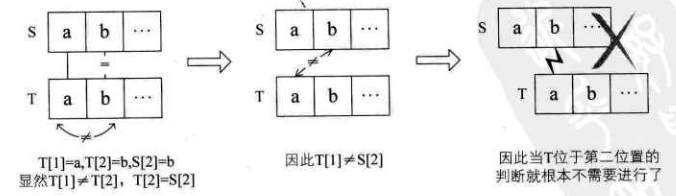

# 5. 串

## 5.1 串的定义  

> 串(string)是由零个或多个字符组成的有限序列，又名叫字符串。

&emsp;&emsp;一般记为 s= "a~1~a~2~a~3~....a~n~"(n >= 0)。串中的字符数目n称为串的长度，零个字符的串称为空串（null string）。  
&emsp;&emsp;空格串，只包含空格的串。注意它与空串的区别，空格串是有内容有长度的，而且可以不止一个空格。  
&emsp;&emsp;子串和主串，串中任意个数的连续字符组成的子序列称为该串的子串，相应地，包含子串的串称为主串。子串在主串中的位置就是子串的第一个字符在主串的序号。比如“over”、“end”、“lie”是“lover”、“friend”、“believe”这些单词字符串的子串。  

## 5.2 串的比较  

&emsp;&emsp;在C语言中比较两个串是否相等，必须是它们串的长度以及它们各个对应位置的字符都相等时，才算相等。即给定两个串：s= "a~1~a~2~...a~n~"，t = "b~1~b~2~...b~m~"，当且仅当 n=m ，且a~1~=b~1~,a~2~=b~2~,...,a~n~=b~m~时，我们认为s=t。  
&emsp;&emsp;对于两个串不相等时，给定两个字符串：s = "a~1~a~2~...a~n~"，t = "b~1~b~2~...b~m~"，当满足以下条件之下时，s<t。1. n<m,且a~i~=b~i~(i=1,2...n)。2.存在某个k <= min(m,n)，使得a~i~ = b~i~(i=1,2,...,k-1),a~k~ < b~k~。  

## 5.3 串的抽象数据类型  

&emsp;&emsp;对于串的基本操作与线性表是有很大差别的。线性表更关注的是单个元素的操作，比如查找一个元素，插入或删除一个元素，但串中更多的是查找子串位置、得到指定位置子串、替换子串等操作。  

```
ADT 串(string)  
Data 
    串中元素仅由一个字符组成，相邻元素具有前驱和后继关系。 
Operation  
    StrAssign(T,*chars):生成一个其值等于字符串常量chars的串T。
    StrCopy(T,S):串s存在，由串s复制得串T。
    ClearString(S):串S存在，将串清空。
    StringEmpty(S):若串S为空，返回true，否则返回false。
    StrLength(S):返回串S的元素个数，即串的长度。
    StrCompare(S,T):串S>T，返回值>0，若S=T，返回0，若S<T，返回值<0。
    Concat(T,S1,S2):用T返回由S1和S2连接而成的新串。
    SubString(Sub,S,pos,len):若S存在，1<=pos<=StrLength(S),且0<=len<=StrLength(S)-pos+1，用Sub返回串S的第pos个字符起长度为len的子串。  
    Index(S,T,pos):若S和T存在，T是非空串，1<=pos<=StrLength(S)。若主串S中存在和串T值相同的子串，则返回它在主串S中第pos个字符之后第一次出现的位置，否则返回0。
    Replace(S,T,V):串S和T存在，1<=pos<=StrInsert(S,pos,T):串S和T存在，1<=pos<=StrLength(S)+1.在串S的第pos个字符串之前插入串T。  
    StrDelete(S,pos,len):串S存在，1<=pos<=StrLength(S)-len+1，从串S中删除第pos个字符起穿肚为len的子串。
```

&emsp;&emsp;对于不同的高级语言，其实对串的基本操作会有不同的定义方法，座椅需要先查看它的参考手册关于字符串的基本操作有那些。比如在C#中，字符串操作就还有ToLower转小写、ToUpper转大写、IndexOf从左查找子串位置、LastIndexOf从右查找子串位置、Trim去除两边空格等比较方便的操作、它们其实就是前面这些基本操作的扩展函数。  
&emsp;&emsp;下面看一个操作Index的实现算法

```
/*T为非空串，若主串S中第pos个字符之后存在与T相等的子串，则返回第一个这样的子串在S中的位置，否则返回0*/
int Index(String S,String T, int pos)
{
    int n,m,i;
    String sub;
    if(pos > 0)
    {
        n = StrLength(S);       /*得到主串S的长度*/
        m = StrLength(T);       /*得到子串T的长度*/
        i = pos;
        while(i <= n-m+1)
        {
            SubString(sub,S,i,m);   /*取主串第i个位置，长度与T相等子串给sub*/
            if(StrCompare(sub,T) != 0)      /*如果两串不相等*/
            {
                ++i;
            }else                           /*如果两串相等*/
            {
                return i;                   /*则返回i值*/
            }
        }
    }
    
    return 0;   /*若无子串与T相等，返回0*/
}
```

## 5.4 串的存储结构  

&emsp;&emsp;串的存储结构与线性表相同，分为两种。  

### 5.4.1 串的顺序存储结构  

&emsp;&emsp;串的顺序存储结构是用一组地址连续的存储单元来存储串中的字符序列的。按照预定义的大小，为每个定义的串变量分配一个固定长度的存储区。一般是用定长数组来定义。  
&emsp;&emsp;既然是定长数组，就存在一个预定义的最大串长度，一般可以将实际的串长度值保存在数组的0下标位置，有的书中也会定义存储在数组的最后一个下标位置。但也有些编程语言不想这么干，觉得存个数字占个空间麻烦。它规定在串值后面加一个不计入串长度的结束标记字符，比如“\0”来表示串值的终结，这个时候，你要想知道此时的串长度，就需要遍历计算一下才知道了。其实这还是需要占用一个空间。  
&emsp;&emsp;上述的串的顺序存储方式其实是有问题的，因为字符串的操作，比如两串的连接Concat、新串的插入StrInsert，以及字符串的替换Replace，都有可能使得串序列的长度超过了数组的长度MaxSize。  
&emsp;&emsp;对于串的顺序存储，有一些变化，串值的存储空间可在程序执行过程中动态分配而得。比如在计算机中存在一个自由存储区，叫做“堆”。这个堆可由C语言的动态分配函数malloc()和free()来管理。

### 5.4.2 串的链式存储结构  

&emsp;&emsp;对于串的链式存储结构，与线性表是相似的，但由于串结构的特殊性，结构中每个元素数据是一个字符，如果也简单的应用链表存储串值，一个结点对应一个字符，就会存在很大的空间浪费。因此，一个结点可以存放一个字符，也可以考虑存放多个字符，最后一个结点若是未被占满时，可以用“#”或其他非串值字符不全。(如图5.1所示) 

<div align="center"></div>

## 5.5 朴素的模式匹配算法  

&emsp;&emsp;找一个单词在一篇文章（相当于一个大字符串）中的定位问题，这种<b>子串的定位操作通常称做串的模式匹配</b>。  
&emsp;&emsp;简单的说，就是对主串的每个字符作为子串开头，与要匹配的字符串进行匹配。对主串做大循环，每个字符开头做T的长度的小循环，直到匹配成功或全部遍历完成为止。  
&emsp;&emsp;前面已经用串的其他操作实现了模式匹配的算法Index。现在考虑不用串的其他操作，而是只用基本的数组来实现同样的算法。注意假设主串S和要匹配的子串T的长度存在S[0]与T[0]中。实现代码如下:  

```
/*返回子串T在主串S中第pos个字符之后的位置。若不存在，则函数返回值为0*/
/*T非空，1<=pos<=StrLength(S)*/
int Index(String s, String T, int pos)
{
    int i = pos;    /*i用于主串S中当前位置下标，若pod不为1，则从pos位置开始匹配*/
    int j = 1;      /*j用于子串T中当前位置下标值*/
    while(i <= S[0] && j <= T[0])   /*若i小于S长度且j小于T的长度时循环*/
    {
        if(S[i] == T[j])    /*两字母相等则继续*/
        {
            ++i;
            ++j;
        }
        else        /*指针后退重新开始匹配*/
        {
            i = i-j+2;      /*i退回上一次匹配收尾的下一位*/
            j = 1;          /*退回到子串T的首位*/
        }
    }
    
    if(j > T[0])
    {
        return i - T[0];
    }
    else
    {
        return 0;
    }
}

```

&emsp;&emsp;最好的情况就是一开始就匹配成功，时间复杂度为O(1)。最坏的情况是每次不成功的匹配都发生在串T的最后一个字符，时间复杂度为O((n-m+1)*m)。  


## 5.6 KMP模式匹配算法  

&emsp;&emsp;D.E.Knuth、J.H.Morris和V.R.Pratt(其中Knuth和Pratt共同研究、Morris独立研究)发表一个模式匹配算法，可以大大避免重复遍历的情况，我们把它称之为克努特——莫里斯——普拉特算法，简称<b>KMP算法</b>。  

### 5.6.1 KMP模式匹配算法原理  

&emsp;&emsp;如果主串S = "abcdefgab",需要匹配T = "abcdex"，那么如果用前面的朴素算法的话，前5个字母，两个串完全相等，直到第6个字母，“f”与“x”不等，如图5.2的1所示：  

<div align="center"></div>  

&emsp;&emsp;接下来，按照朴素模式匹配算法，应该是如图5.2的流程23456。即主串S中当i=2、3、4、5、6时，首字符与子串T的首字符均不等。  
&emsp;&emsp;似乎这也是理所当然的，原来的算法就是这样设计的。可仔细观察发现，对于要匹配的子串T来说，“abcdex”首字母“a”与后面的串“bcdex”中任意一个字符都不相等。也就是说，既然“a”不与自己后面的子串中任何一字符相等，那么对于图5.2的1来说，前面五位字符分别相等，意味着子串T的首字符“a”不可能与S串的第2位到第5位的字符相等。在图5.2中，23456的判断都是多余。  
&emsp;&emsp;注意这里是理解KMP算法的关键。如果我们知道T串中首字符“a”与T中后面的字符均不相等（这个是前提）。而T串的第二位的“b”与S串中第二位的“b”在图5.2的1中已经判断是相等的，那么也就意味着，T串中首字符的“a”与S串中的第二位“b”是不需要判断也知道它们是不可能相等了，这样图5.2的2这一步判断是可以省略的。如图5.3所示

<div align="center"></div>

&emsp;&emsp;同样道理，在我们知道T串中首字符“a”与T中后面的字符均不相等的前提下，T串的“a”与后面S串中后面“c”、“d”、“e”也都可以在1之后就可以确定是不相等的，所以这个算法当中2345没有必要，只要保留16即可，如图5.4所示。  

<div align="center"></div>  

&emsp;&emsp;之所以保留6中判断是因为在1中T[6]≠S[6]，尽管我们已经知道T[1]≠T[6],但也不能断定T[1]一定不等于S[6],因此需要保留6这一步。如果T串后面也含有首字符“a”的字符呢？  
&emsp;&emsp;假设S=“abcabcabc”，T=“abcabx”。对于开始的判断，前5个字符完全相等，第6个字符不等，如图5.5中的1。此时，根据刚才的经验，T的首字符“a”与T的第二位字符“b”、第三位字符“c”均不等，所以不需要做判断，图5.5的朴素算法步骤23都是多余。 

<div align="center"></div>  

&emsp;&emsp;因为T的首位“a”与T第四位“a”相等，第二位的“b”与第五位的“b”相等。而在1时，第四位的“a”与第五位的“b”已经与主串S中的相应位置比较过了，是相等的，因此可以断定，T的首字符“a”、第二位的字符“b”与S的第四位字符和第五位字符也不需要比较了，肯定是相等的，所以45这两个比较得出字符相等的步骤也可以省略。  
&emsp;&emsp;也就是说，对于在子串中有与首字符相等的字符，也是可以省略一部分不必要的判断步骤，如图5.6所示，省略掉右图的T串前两位“a”与“b”同S串中的4、5位置字符匹配操作。  

<div align="center"></div>

&emsp;&emsp;对比这两个例子，我们会发现在1时，我们的i值，也就是说主串当前位置的下标是6，步骤2345，i的值是2、3、4、5，到了步骤6，i的值才又回到了6。即我们在朴素的模式匹配算法中，主串的i值是不断地回溯来完成的。而我们的分析发现，，这种回溯其实是可以不需要——这所谓好马不吃回头草，我们的KMP模式匹配算法就是为了让这没必要的回溯不发生。  
&emsp;&emsp;既然i值不回溯，也就是不可以变小，那么要考虑的变化就是j值了。通过观察也可发现，我们屡屡提到了T串的首字符与自身后面字符的比较，发现如果有相等字符，j值的变化就会不相同。也就是说，这个j值的变化和主串其实没什么关系，关键就取决于当前字符之前的串的前后缀的相似度。  
&emsp;&emsp;我们把T串各个位置的j值的变化定义为一个数组next，那么next的长度就是T串的长度。于是我们可以得到下面的函数定义：  

<div align="center"></div>  

### 5.6.2 next数组值推导  

&emsp;&emsp;具体如何推导出一个串的next数组值呢？例子如下：  

1. T=“abcdex”，j=12345，next[j]=011111
   1. 当j=1时，next[1]=0;
   2. 当j=2时，j由1到j-1就只有字符“a”，属于其他情况next[2]=1
   3. 当j=3时，j由1到j-1串是“ab”，显然“a”与“b”不相等，属其他情况，next[3]=1;
   4. 依次类推，最终此T串的next[j]为011111
2. T=“abcabx”，j=123456，next[j]=011123
   1. 当j=1时，next[1]=0
   2. 当j=2时，同上例说明，next[2]=1
   3. 当j=3时，同上,next[3]=1
   4. 当j=4时，同上,next[4]=1
   5. 当j=5时，此时j由1到j-1的串是“abca”，前缀字符“a”与后缀字符“a”相等(前缀用下划线表示，后缀用斜体表示)，因此可推算出k值为2(由‘p~1~...p~k-1~’='p~j-k+1~...p~j-1~'，得到p~1~=p~4~)因此next[5]=2；
   6. 当j=6时，j由1到j-1的串是“abcab”,由于前缀字符“ab”与后缀“ab”相等，所以next[6]=3。

&emsp;&emsp;我们可以根据经验得到如果前后缀得到如果前后缀一个字符相等，k值是2，两个字符k值是3，n个相等k值就是n+1

3. T=“ababaaaba”，j=123456789，next[j]=011234223
   1. 当j=1时，next[1]=0
   2. 当j=2时，同上next[2]=1;
   3. 当j=3时，同上next[3]=1
   4. 当j=4时，j由1到j-1的串是“aba”，前缀字符“a”与后缀字符“a”相等，next[4]=2
   5. 当j=5时，j由1到j-1的串是“abab”，由于前缀字符“ab”与后缀“ab”相等，所以next[5]=3
   6. 当j=6时，j由1到j-1的串是“ababa”，由于前缀字符“aba”与后缀“aba”相等，所以next[6]=4
   7. 当j=7时，j由1到j-1的串是“ababaa”，由于前缀字符“ab”与后缀“aa”并不相等，只有“a”相等，所以next[7]=2
   8. 当j=8时，j由1到j-1的串是“ababaaa”，只有“a”相等，所以next[8]=2
   9. 当j=9时，j由1到j-1的串是“ababaaab”，由于前缀字符“ab”与后缀“ab”相等，所以next[9]=3
4. T=“aaaaaaaab”，j=123456789，next[j]=012345678
   1. 当j=1时,next[1]=0
   2. 当j=2时，同上next[2]=1
   3. 当j=3时，j由1到j-1的串是“aa”，前缀字符“a”与后缀字符“a”相等，next[4]=3
   4. 当j=4时，j由1到j-1的串是“aaa”，由于前缀字符“aa”与后缀“aa”相等，所以next[4]=3
   5. ...
   6. 当j=9shi，j由1到j-1的串是“aaaaaaaa”，由于前缀字符“aaaaaaa”与后缀“aaaaaaa”相等，所以next[9]=8

### 5.6.3 KMP模式匹配算法实现  

```
//*通过计算返回子串T的next数组*/
vvoid get_next(String T,int *next)
{{
    int i,j;
    i = 1;
    j = 0;
    
    next[1] = 0;
    
    while (i<T[0])  /*此处T[0]表示串T的长度*/
    {
        if(j == 0 || T[i] == T[j])  /*T[i]表示后缀的单个字符，T[j]表示前缀的单个字符*/
        {
            ++i;
            ++j;
            next[i] = j;
        }
        else
        {
            j = next[j];    /*若字符不相等，则j值回溯*/
        }
    }
}}
````

&emsp;&emsp;这段代码的目的就是为了计算出当前要匹配的串T的next数组  

```
/*返回子串T在主串S中第pos个字符之后的位置。若不存在，则函返回值为0*/
/*T非空，1<=pos<=StrLength(S)*/

int Index_KMP(String S, String T, int pos)
{
    int i = pos;    /*i用于主串S当前位置下标值，若pos不为1，则从pos位置开始匹配*/
    int j =1;       /*j用于子串T中当前位置下标值*/
    int next[255];  /*定义一next数组*/
    get_next(T,next);/*对串T进行分析，得到next数组*/
    while(i <= S[0] && j <= T[0])   /*若i小于S的长度且J小于T的长度时，循环继续*/
    {
        if(j==0 || S[i] == T[j])    /*两字母相等则继续，与朴素算法比较增加了j=0判断*/
        {
            ++i;
            ++j;
        }
        else    /*指针后退重新开始匹配*/
        {
            j = next[j];    /*j返回合适的位置,i值不变*/
        }
    }
    
    if(j > T[0])
    {
        return i-T[0];
    }
    else
    {
        return 0;
    }
}

```

&emsp;&emsp;j==0 和 j=next[j]为相对于朴素匹配算法增加的代码，改动不算大，关键就是去掉了i值回溯的部分。对于get_next函数来说，若T的长度为m，因只涉及到简单的单循环，其时间复杂度为O(m),而由于i值的不回溯，使得index_KMP算法效率得到了提高，while循环的时间复杂度为O(n)。因此，整个算法的时间复杂度为O(n+m)，相较于朴素模式匹配算的O((n-m+1)*m)来说，要好一些。  

### 4.6.4 KMP匹配算法改进  

&emsp;&emsp;后来有人发现，KMP还是缺陷的。比如，如果我们的主串S=“aaaabcde”，子串T=“aaaaax”，其next数组值分别为012345，在开始时，当i=5、j=5时，我们发现“b”与“a”不相等，如图5.8的1，因此j=next[5]=4，如图中的2，此时“b”与第4位置的“a”依然不等，j=next[4]=3，如图中的3，后依次是45，直到j=next[1]=0时，根据算法，此时i++,j++得到i=6,j=1，如图中的6  

<div align="center"></div>  

&emsp;&emsp;我们发现，当中的2345步骤，其实是多余的判断。由于T串的第二、三、四、五位置的字符都与首位“a”相当，那么可以用首位next[1]的值去取代与它相等的字符后续next[j]的值，这是个很好的办法。因此我们对求next函数进行了改良。  
&emsp;&emsp;假设取代的数组为nextval，代码如下：  

```
/*求模式串T的next函数修正值并存入数组nextval*/  

void get_nextval(String T, int *nextval)
{
    int i,j; 
    i = 1;
    j = 0;
    nextval[1] = 0;
    while(i < T[0] ) /*此处T[0]表示串T的长度*/
    {
      if(j==0 || T[i]==T[j])  /*T[i]表示后缀的单个字符，T[j]表示前缀的单个字符*/
      {
         ++i;
         ++j;
         if(T[i] != T[j])
         {
            nextval[i] = j;   /*若当前字符为前缀字符不同，则当前的j为nextval在i位置的值*/
         }else
         {
            nextval[i] = nextval[j];   /*如果与前缀字符相同，则将前缀字符的nextval值赋值给nextval在i位置的值*/
         }
      }
      else {
         j = nextval[j];   /*若字符不相同，则j值回溯*/
      }
    }
}
```

&emsp;&emsp;实际匹配算法，只需要将“get_next(T,next)”改为“get_nextval(T,next)”即可。

### 5.6.5 nextval数组值推导

&emsp;&emsp;改良后，我们之前的例子nextval值就与next值不完全相同了。比如：  
- T="ababaaaba",j=123456789,next[j]=011234223,nextval[j]=010104210

1. 当j=1时，nextval[1]=0
2. 当j=2时，因第二位字符“b”的next值是1，而第一位就是“a”，它们不相等，所以nextval[2]=next[2],维持原值
3. 当j=3时，因为第三位字符“a”的next值为1，所以与第一位的“a”比较得它们相等，所以nextval[3]=next[1]=0
4. 当j=4时，第四位的字符“b”next值为2，所以与第二位的“b”相比较得到结果是相等，因此nextval[4]=nextval[2]=1
5. 当j=5时，next值为3，第五个字符“a”与第三个字符“a”相等，因此nextval[5]=nextval[3]=0
6. 当j=6时，next值为4，第六个字符“a”与第四个字符“b”不相等，因此nextval[6]=4
7. 当j=7时，next值为2，第七个字符“a”与第二个字符“b”不相等，因此nextval[7]=2
8. 当j=8时，next值为2，第八个字符“b”与第二个字符“b”相等，因此nextval[8]=next[2]=1
9. 当j=9时，next值为3，第九个字符“a”与第三个字符“a”相等，因此nextval[9]=nextval[3]=1

- T="aaaaaaaab",j=123456789,next[j]=012345678,nextval[j]=000000008

1. 当j=1时，nextval[1]=0
2. 当j=2时，next值为1，第二个字符与第一个字符相等，所以nextval[2]=nextval[1]=0
3. 以此类推，其后都是0......
4. 当j=9时，next值为8，第九个字符“b”与第八个字符“a”不相等，所以nextval[9]=8  

&emsp;&emsp;总结改进过的KMP算法，它是在计算出next值的同时，如果a位字符与它next值指向b位字符相等，则该a位的nextval就指向b位的nextval值，如果不等，则该a位的nextval值就是它自己a位的next的值。  

## 5.7 总结回顾  
&emsp;&emsp;串(String)是由零个或多个字符组成的有限序列，又名叫字符串。本质上，它是一种线性表的扩展，但相对于线性表关注一个个元素来说，对串这种结构更多的是关注它子串的应用问题，如查找、替换等操作。现在的高级语言都有针对串的函数可以调用。我们在使用这些函数的时候，同时也应该要理解它在当中的原理，以便于在碰到复杂问题时，可以更加灵活的使用，比如KMP模式匹配算法的学习，就是更有效地去理解index函数当中的实现细节。