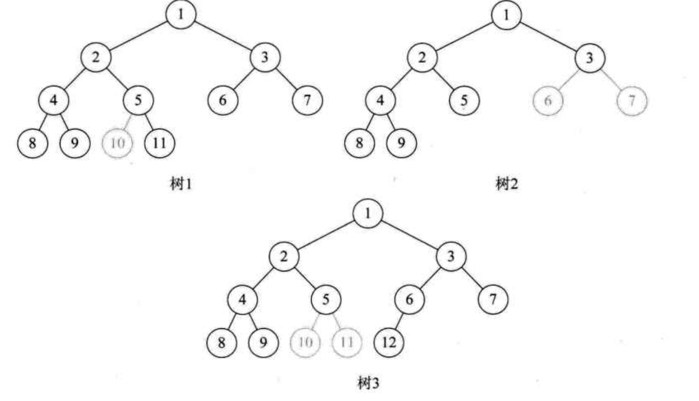

# 6.  树  

## 6.1 树的定义  

&emsp;&emsp;之前一直谈的是一对一的线性结构，但是还有很多一对多的情况需要处理，所以需要研究这种一对多的数据结构——“树”。  
> 树(Tree)是n(n>=0)个结点的有限集。n=0时称为空树。在意一颗非空树中：
> (1)有且仅有一个特定的称为根(Root)的结点
> (2)当n>1时，其余结点可分为m(m>0)个互不相交的有限集T~1~、T~2~、...、T~m~，其中每一个集合本身又是一棵树，并且称为根的子树(SubTree)

<div align="center"></div>  

&emsp;&emsp;树的定义其实就是我们在讲解栈提到的递归的方法。也就是说树的定义之中还用到了树的概念。这是一种比较新的定义方法。对于树的定义还需要强调两点：  
1. n>0时根结点是唯一的，不可能存在多个根结点，别和现实中的树混在一起，现实中的树有很多根须，那是真实的树，数据结构中的树是只能有一个根结点。  
2. m>0时，子树的个数没有限制，但它们一定是互不相交的。 

### 6.1.1 结点分类  
&emsp;&emsp;树的结点包含一个数据元素及若干指向其子树的分支。<b>结点拥有的子树数称为结点的度(Degree)。度为0的结点称为叶结点(Leaf)或终点结点；度不为0的结点称为非终端结点或分支结点。除根结点之外，分支结点也称为内部结点。树的度是树内各节点的度的最大值。<b/>如图6.2所示，因为这棵树结点的度的最大值是结点D的度，为2，所以树的度也是3。  

<div align="center"></div>

### 6.1.2 结点之间的关系  
&emsp;&emsp;<b>结点的子树的根称为该结点的孩子(Child)，相应地，该结点称为孩子的双亲(Parent)。同一个双亲的孩子之间乎称兄弟(Sibling)。结点的祖先是从根到该结点锁经分支上的所有结点。</b>所以对于H来说，D、B、A都是它的祖先。反之，以某结点为根的子树中的任一结点都称为该结点的子孙。 

### 6.1.3 树的其他相关概念  

&emsp;&emsp;结点的层次(Level)从根开始定义起，根为第一层，根的孩子为第二层。若某结点在第I层，则其子树的根就在I+1层。其双亲在同一层的结点互为堂兄弟。树中结点的最大层次称为树的深度(Depth)或高度。  
&emsp;&emsp;如果将树中结点的各子树看成从左至右是有次序的，不能互换的，则称该树的有序树，否则称为无序树。  
&emsp;&emsp;森林(Forest)是m(m>=0)棵互不相交的树的集合。

- 线性结构
  - 第一个数据元素：无前驱
  - 最后一个数据元素：无后继
  - 中间元素：一个前驱一个后继
- 树结构
  - 根结点：无双亲，唯一
  - 叶结点：无孩子，可以多个
  - 中间结点：一个双亲多个孩子

## 6.2 树的抽象数据类型  

```
ADT 树(tree)
Data
  树由一个根结点和若干颗子树构成。树中结点具有相同数据类型及层次关系  
Operation
  InitTree(*T):构建空树T
  DestoryTree(*T):销毁树T
  CreateTree(*T,definition):按definition中给出树的定义来构建树
  ClearTree(*T):若树T存在，则将树T清为空树
  TreeEmpty(T):若T为空树，返回true,否则返回false
  TreeDepth(T):返回T的深度
  Root(T):返回T的根结点
  Value(T,cur_e):cur_e是树T中一个结点，返回此结点的值
  Assign(T,cur_e,value):给树T的结点cur_e赋值为value
  Parent(T,cur_e):若cur_e是树T的非根结点，则返回它的双亲，否则返回空
  LeftChild(T,cur_e):若cur_e是树T的非叶结点，则返回它的最左孩子，否则返回空
  RightSilbling(T,cur_e):若cur_e有右兄弟，则返回它的右兄弟，否则返回空
  InsertChild(*T,*p,i,c):其中p指向树T的某个结点，i为所指结点p的度加上1，非空树c与T不相交，操作结果为输入c为树T中p指结点的第i棵子树
  DeleteChild(*T,*p,i):其中p指向树T的某个结点，i为所指结点p的度，操作结果为删除T中p所指结点的第i棵子树
endADT
```

## 6.3 树的存储结构  

### 6.3.1 双亲表示法

&emsp;&emsp;在每个结点中，附设一个指示器指示其双亲结点到链表中的位置。  

<div align="center"></div>  

&emsp;&emsp;其中data是数据域，存储结点的数据信息。而parent是指针域，存储该结点的双亲在数组中的下标。以下是我们的双亲表示法的结点结构定义代码。

```
/* 树的双亲表示法结点结构定义 */
#define MAX_TREE_SIZE 100
typedef int TElemType;  /*树结点的数据类型，目前暂定为整型 */
typedef struct PTNode /*结点结构*/
{
  TElemType data;     /*结点数据*/
  int parent;         /*双亲位置*/
}PTNode;

typedef struct      /*树结构*/
{
  PTNode nodes[MAX_TREE_SIZE];  /*结点数组*/
  int r,n;
}PTree;
``` 

&emsp;&emsp;有了这样的结构定义，就可以实现双亲表示法了。由于根结点是没有双亲的，所以我们约定根结点的位置域设置为-1，这也就意味着，所有的结点都有它双亲的位置，如图6.4中的树结构和图6.5中的树双亲表示所示。  

<div align="center"></div>  

<div align="center"></div>

&emsp;&emsp;这样的存储结构，便可以根据结点的parent指针很容易找到它的双亲结点，所用的时间复杂度为O(1)，直到parent为-1时，表示找到了树结点的根。如果要知道结点的孩子是什么便需要整个结构才行，在次基础上改进一下。  
&emsp;&emsp;增加一个结点最左边孩子的域，不妨叫它长子域，这样就可以很容易得到结点的孩子。如果没有孩子的结点，这个长子域就设置为-1，如图6.6所示：  

<div align="center"></div>

&emsp;&emsp;对于有0个或1个孩子结点来说，这样的结构是解决了要找结点孩子的问题。甚至是有2个孩子，知道了长子是谁，另一个当然就是次子了。  
&emsp;&emsp;另外一个问题场景，关注各兄弟之间的关系，双亲表示便无法体现这样的关系，可以增加一个右兄弟域体现兄弟关系，也就是说，每一个结点如果它存在右兄弟，则记录下右兄弟的下标。同样，如果右兄弟不存在，则赋值为-1.  
&emsp;&emsp;<b>存储结构的设计是一个非常灵活的过程。一个存储结构设计是否合理，取决于基于该存储结构的运算是否适合、是否方便，时间复杂度好不好等。</b>  

### 6.3.2 孩子表示法  

&emsp;&emsp;换一种完全不同的考虑方法。由于树中每个结点可能有多棵子树，可以考虑多重链表，即<b>每个结点有多个指针域，其中每个指针指向一颗子树的根结点，我们把这种叫做多重链表表示法。</b>不过，树的每个结点的度，也就是它的孩子个数是不同的。所以可以设计两种方案来解决。  
- 方案一
  - 指针域的个数就等于树的度，树的度是树各个结点度的最大值。这种方法对于树中各结点的度相差很大时，显然是很消费空间的，因为有很多结点，它的指针域都是空的，不过如果树的各结点度相差很小时，那就意味着开辟的空间被充分利用这时存储结构的缺点反而变成了优点。  
- 方案二
  - 每个结点指针域的个数等于该结点的度，可以专门取一个位置存储结点指针域的个数。这种方法克服了浪费空间的缺点，对空间利用率是很高了，但是由于各个结点的链表是不相同的结点，加上要维护结点的度的数值，在运算上就会带来时间上的损耗。  

&emsp;&emsp;上述方案中为了要遍历整棵树，把每个结点放到放到一个顺序存储结构的数组中是合理的，但每个结点的孩子有多少是不确定的，所以再对每个结点的孩子建立一个单链表体现它们的关系。  
&emsp;&emsp;<b>把每个结点的孩子结点排列起来，以单链表作存储结构，则n个结点有n个孩子链表，如果是叶子结点则此单链表为空。然后n个头指针又组成一个线性表，采用顺序存储结构，存放进一个一维数组中。</b>如图6.7所示：  


<div align="center"></div>  

&emsp;&emsp;以下即使孩子表示法的结构定义代码：  

```
/*树的孩子表示法结构定义*/
#define MAX_TREE_SIZE 100
typedef struct CTNode /*孩子结点*/
{
  int child;
  struct CTNode *next;
} *ChildPtr;

teypedef struct   /*表头结构*/
{
  TElemType data;
  ChildPtr firstchild;
} CTBox;

typedef struct      /*树结构*/
{
  CTBox nodees[MAX_TREE_SIZE];  /*结点数组*/
  int r,n;        /*根的位置和结点数*/
} CTree;
```

### 6.3.3 孩子兄弟表示法  

&emsp;&emsp;刚才分别才能够双亲的角度和从孩子的角度研究树的存储结构，如果从树结点的兄弟的角度来说，对于树这样的层级结构来说，只研究结点的兄弟是不行的。观察后发现，<b>任意一棵树，它的结点的第一个孩子如果存在就是唯一的，它的右兄弟如果存在也是唯一的。因此设置两个指针，分别指向该结点的第一个孩子和此结点的右兄弟。</b>  
&emsp;&emsp;其中data是数据域，firstchild为指针域，存储该结点的第一个孩子的结点的存储地址，rightsib是指针域，存储该结点的右兄弟结点的存储地址。  

```
/*树的孩子兄弟表示法结构定义*/
typedef struct CSNode
{
  TElemType data;
  struct CSDNode *firstchild,*rightsib;
} CSNode,*CSTree;
``` 

&emsp;&emsp;这种表示法，给查找某个结点的某个孩子带来了方便，只需要通过firstchild找到此结点的长子，然后再通过长子结点的rightsib找到它的二弟，接着一直下去，直到找到具体的孩子。当然，如果想找某个结点的双亲，这个表示法也是有缺陷的，完全可以再增加一个parent指针域来解决快速查找双亲的问题。  

## 6.4 二叉树的定义  

```
二叉树(Binary Tree)是n(n>=0)个结点的有限集合，该集合或者为空集(称为空二叉树)，或者由一个根结点和两棵互不相交的、分别称为根结点的左子树和右子树的二叉树组成。  
```

### 6.4.1 二叉树的特点  

- 每个结点最多有两棵子树，所以二叉树中不存在度大于2的结点。注意不是只有两棵子树。而是最多有。没有子树或者有棵子树都是可以的。  
- 左子树和右子树是有顺序的，次序不能任意颠倒。就像人是双手、双脚，但显然左手、左脚和右手、右脚是不一样的，右手戴左手套、右脚穿左鞋都会极其别扭和难受。  
- 即使树中某结点只有一棵子树，也要区分它是左子树还是右子树。图6.8中，树1和树2是同一棵树，但它们却是不同的二叉树。  

<div align="center"></div>  

&emsp;&emsp;二叉树具有五种基本形式：  

- 空二叉树 
- 只有一个根结点
- 根结点只有左子树
- 根结点只有右子树
- 根结点既有左子树又有右子树  

### 6.4.2 特殊二叉树  

- <font color=green>斜树</font>：所有的结点都只有左子树的二叉树叫左斜树。所有结点都是只有右子树的二叉树叫右斜树。这两者统称为斜树。
- <font color=green>满二叉树</font>：在一棵二叉树中，如果所有分支结点都存在左子树和右子树，并且所有叶子都在同一层上，这样的二叉树称为满二叉树。
  - 叶子只能出现在最下一层。出现在其他层就不可能达成平衡
  - 非叶子结点的度一定是2.否则就是“缺胳膊少腿”了
  - 在同样深度的二叉树中，满二叉树的结点个数最多，叶子数最多
- <font color=green>完全二叉树</font>：对一棵具有n个结点的二叉树按层序编号，如果编号i(1<=i<=n)的结点与同样深度的满二叉树中编号为i的结点在二叉树中位置完全相同，则这棵二叉树称为完全二叉树。 
  - 叶子结点只能出现在最下两层
  - 最下层的叶子一定集中在左部连续位置
  - 倒数二层，若有叶子结点，一定都在右部连续位置
  - 如果结点度为1，则该结点只有左孩子，而不存在只有右子树的情况
  - 同样结点数的二叉树，完全二叉树的深度最小

&emsp;&emsp;满二叉树一定是一棵完全二叉树，但完全二叉树不一定是满的其次，完全二叉树的所有结点与同样深度的满二叉树，它们按层序编号相同的结点，是一一对应的。这里有个关键词是按层次序编号，像图6.9中的树1，因为5结点没有左子树，却有右子树，那就使得按层序编号的第10个编号空挡了。同样的，在图中的树2，由于3结点没有子树，所以使得6、7编号的位置空挡了。树3又是因为5编号下没有子树造成第10和第11位置空挡。  

<div align="center"></div>

## 6.5 二叉树的性质 

### 二叉树性质 1 

&emsp;&emsp;<b>性质1：在二叉树的第i层上至多有2^i-1^个结点(i>=1)。</b>
&emsp;&emsp;第一层是根结点，只有一个，所以2^1-1^=2^0^=1；第二层有两个，2^2-1^=2^1^=2；第三层有4个，2^3-1^=2^2^=4......通过<font color=orange>数学归纳法</font>的论证，可以很容易得出在二叉树的第i层上至多有2^i-1^(i>=1)的结论。  

### 二叉树性质 2

&emsp;&emsp;<b>性质1：深度为k的二叉树至多有2^k^-1个结点(i>=1)。</b>  
&emsp;&emsp;注意这里一定要看清楚，是2^k^后再减去1.深度为k意思就是有ke层的二叉树，如果有一层，至多有1 = 2^1^ -1个结点;如果有二层，至多有3 = 2^2^ -1个结点；如果有三层，至多有7 = 2^3^ -1个结点......

### 二叉树性质 3  

&emsp;&emsp;<b>性质3：对任何一棵二叉树T，如果其终端结点数为n0，度为2的结点数为n2，则n0 = n2 + 1</b>
&emsp;&emsp;终端结点数其实就是叶子结点数，而一棵二叉树，除了叶子结点外，剩下的就是度为1或2的结点数，设n1为度是1的结点数。则树T<font color=red>结点总数</font>n=n0+n1+n2
&emsp;&emsp;比如图6.10的例子，结点总数为10，它是由A、B、C、D等度为2结点，F、G、H、I、J等度为0的叶子结点和E这个度为1的结点组成。总和为4+1+5=10  

<div align="center"></div>  

&emsp;&emsp;再数一数它的连接线数，由于根结点只有分支出去，没有分支进入，所以分支线总数为结点总数减去1，图6.10就是9个分支。对于A、B、C、D结点来说，它们都有两个分支线出去，而E结点只有一个分支线出去。所以总分支线为4X2+1X1=9。  
&emsp;&emsp;用代数表达式就是<font color=red>分支线总数</font>=n-1=n1+2n2.因为等式n=n0+n1+n2，所以可以推导出n0+n1+n2-1=n1+2Xn2。结论就是n0 = n2 + 1。  

### 二叉树性质 4 

&emsp;&emsp;<b>性质4：具有n个结点的完全二叉树的深度为 [$\log_2^{n}$] + 1([x]表示不大于x的最大整数)。</b>  
&emsp;&emsp;由满二叉树的定义可以知道，深度为k的满二叉树的结点数n一定是2^k^-1。因为这是最多的结点个数。那么对于n=2^k^-1倒推得到满二叉树的度数为k=$\log_2^{n+1}$，比如结点数为15的满二叉树，度为4。
&emsp;&emsp;完全二叉树前面已经提到，它是一棵具有n个结点的二叉树，若按层序编号后其编号与同样深度的满二叉树中编号结点在二叉树中位置相同，那么它就是完全二叉树。也是就说，它的叶子结点只会出现最下面的两层。  
&emsp;&emsp;它的结点数一定少于等于同样度数的满二叉树的结点数2^k^-1，但一定多于2^k-1^-1.即满足2^k-1^-1 < n <= 2^k^-1。由于结点数n是整数，n<=2^k^-1意味着n<2^k^,所以完全二叉树的度数k = [$\log_2^{n}$] +1  

### 二叉树性质 5  

&emsp;&emsp;<b>性质5：如果对一棵有n个结点的完全二叉树(其深度为[$\log_2^{n}$]+1)的结点按层序编号(从第1层到第[$\log_2^{n}$] + 1层，每层从左到右)，对于任意结点i(1<=i<=n)有：</b>  

- 如果 i =1，则结点i是二叉树的根，无双亲;如果i>1，则其双亲是结点[i/2]
- 如果 2i > n，则结点i无左孩子(结点i为叶子结点)；否则其左孩子是结点2i
- 如果 2i+1>n，则结点i无又孩子，否则其右孩子是结点2i+1

&emsp;&emsp;以图6.11为例，这是一个完全二叉树，度为4，结点总数为10。  
&emsp;&emsp;第一条，i = 1时就是根结点。i>1时，比如说7，它的双亲就是[7/2]=3，结点9，它的双亲就是[9/2]=4  
&emsp;&emsp;第二条，比如结点6，因为2X6=12超过了结点总数10，所以结点6无左孩子，它是叶子结点。同样，而结点5，因为2X5=10正好是结点总数10，所以它的左孩子是结点10  
&emsp;&emsp;第三条，比如说结点5，因为2X5+1=11大于结点总数10.所以它无右孩子。而结点3，因为2X3+1=7小于10，所以它的右孩子是结点7 

## 6.6 二叉树的存储结构  

### 6.6.1 二叉树顺序存储结构

&emsp;&emsp;顺序存储对树这种一对多的关系结构实现起来是比较困难的。但是二叉树是一种特殊的树，由于它的特殊性，使得用顺序存储结构也可以实现。  
&emsp;&emsp;二叉树的顺序存储结构就是用一维数组存储二叉树中的结点，并且结点的存储位置，也就是数组的下标要能体现结点之间的逻辑关系，比如双亲与孩子的关系，左右关系兄弟等。一棵完全二叉树如图6.11所示

<div align="center"></div>  

&emsp;&emsp;将这颗二叉树存入到数组中，相应的下标对应其同样的位置，如图6.12所示：  

<div align="center"></div>

&emsp;&emsp;由于它定义的严格，所以用顺序结构也可以表现出二叉树的结构来，当然对于一般的二叉树，尽管层序编号不能反映逻辑关系，但是可以按其完全二叉树编号，只不过，不存在的结点设置一个占位符。这样，考虑一种极端情况，一棵深度为k的右斜树，它只有K个结点，却需要分配2^k^-1个存储单元空间，显然是对存储空间的浪费。<font color=orange>顺序存储结构一般只用于完全二叉树</font>。  


### 6.6.2 二叉链表  

&emsp;&emsp;既然顺序存储适用性不强，便考虑链式存储结构。<b>二叉树每个结点最多两个孩子，所以为它设计一个数据域和两个指针域</b>是比较自然的想法，这样的链表叫做<font color=green>二叉链表</font>。  

```
/*二叉树的二叉链表结点结构定义*/
typedef struct BiTNode  /*结点结构*/
{
  TElemType data;     /*结点数据*/
  struct BiTNode *lchild,*rchild; /*左右孩子指针*/
}BiTNode, *BiTree;
```

## 6.7 遍历二叉树  

### 6.7.1 二叉树遍历原理

> 二叉树的遍历(traversing binary tree)是指从根结点出发，按照某种次序依次访问二叉树中所有结点，使得每个结点被访问一次且仅被访问一次。

&emsp;&emsp;这里有两个关键词：访问和次序。  
&emsp;&emsp;访问其实是要根据实际需要来确定具体做什么，比如对每个结点进行相关计算，输出打印等，它算作是一个抽象操作。  
&emsp;&emsp;二叉树的遍历次序不同于线性结构，最多也就是从头至尾、循环、双向等简单的遍历方式。树的结点之间不存在唯一的前驱和后继关系，在访问一个结点后，下一个被访问的结点面临着不同的选择。  

### 6.7.2 二叉树遍历方法  

&emsp;&emsp;二叉树的遍历方式可以很多，主要就分为四种：  

1. 前序遍历  

&emsp;&emsp;规则是若二叉树为空，则空操作返回，否则先返回根结点，然后前序遍历左子树，再前序遍历右子树。如图6.13所示，遍历的顺序为：ABDGHCEIF

<div align="center"></div>  

2. 中序遍历  

&emsp;&emsp;规则是若树为空，则空操作返回，否则从根结点开始(注意并不是先返回根结点)，中序遍历根结点的左子树，然后是返回根结点，最后中序遍历右子树。如图6.14所示，遍历的顺序为：GDHBAEICF。  

<div align="center"></div> 

3. 后序遍历 

&emsp;&emsp;规则是若树为空，则空操作返回，否则从左到右先叶子后结点的方式遍历访问左右子树，最后是访问根结点。如图6.15所示，遍历的顺序为：GHDBIEFCA。  

<div align="center"></div>

4. 层序遍历  

&emsp;&emsp;规则是若树为空，则空操作返回，否则从树的第一层，也就是根结点开始访问，从上而下逐层遍历，在同一层中，按从左到右的顺序对结点逐个访问。如图6.16所示，遍历的顺序为ABCDEFGHI。  

<div align="center"></div>

### 6.7.3 前序遍历算法  

&emsp;&emsp;二叉树的定义是用递归的方式，所以，实现遍历算法也可以采用递归，而且极其简洁明了。  

```
/*二叉树的前序遍历递归算法*/
void PreOrderTraverse(BiTree T)
{
  if(T==NULL)
  {
    return;
  }
  printf("%c",T->data); /*显示结点数据，可以更改为其他对结点操作*/
  PreOrderTraverse(T->lchild);  /*再先序遍历左子树*/
  PreOrderTraverse(T->rchild);  /*最后先序遍历右子树*/
}
```

### 6.7.4 中序遍历算法  

```
/*二叉树的中序遍历递归算法*/
void InOrderTraverse(BiTree T)
{
  if(T == NULL)
  {
    return;
  }
  InOrderTraverse(T->lchild); /*中序遍历左子树*/
  printf("%c",T->data);   /*显示结点数据，可以更改为其他对结点操作*/
  InOrderTraverse(T->rchild);/*最后中序遍历右子树*/
}
```

### 6.7.5 后序遍历算法  

```
/*二叉树的后序遍历递归算法*/
void PostOrderTraverse(BiTree T)
{
  if(T==NULL)
  {
    return;
  }
  
  PostOrderTraverse(T->lchild);/*先后序遍历左子树*/
  PostOrderTraverse(T->rchild);/*再后序遍历右子树*/
  printf("%c",T->data); /*显示结点数据，可以更改为其他对结点操作*/
}
```

### 6.7.6 推导遍历结果  

&emsp;&emsp;已知一棵二叉树的前序遍历序列为ABCDEF、中序遍历序列为CBAEDF，请问这棵二叉树的后序遍历结果是多少？前序是根左右，中序是左根右，后序是左右根。牢记这前中后序的原理，即可。结果为CBEFDA

## 6.8 二叉树的建立  

```
/*按前序输入二叉树中结点的值(一个字符)*/
/*#表示空树，构造二叉链表表示二叉树T*/
void CrerateBiTree(BiTree *T)
{
  TElemType ch;
  scanf(“%c”,&ch);
  if(ch == "#")
  {
    *T = NULL;
  }
  else
  {
    *T = (BiTree)malloc(sizeof(BitNode));
    if(!*T)
    {
      exit(OVERFLOW);
      (*T)->data=ch;/*生成根结点*/
      CreateBitTree(&(*T)->lchild); /*构建左子树*/
      CreateBitTree(&(*T)->rchild); /*构建右子树*/
    }
  }
}
```  

&emsp;&emsp;建立二叉树，也是利用了递归的原理。只不过在原来应该是打印结点的地方，改成了生成结点、给结点赋值的操作而已。  

## 6.9 线索二叉树  

### 6.9.1 线索二叉树原理  

&emsp;&emsp;上述的指针域并不是都充分的利用了，有很多空指针域的存在。建立在已经遍历过的基础之上，可以很清楚的知道任意一个结点，它的前驱和后继是哪一个。但在二叉链表上，只能知道每个结点指向其左右孩子结点的地址，而不知道某个结点的前驱是谁，后继是谁。可以考虑利用哪些空地址，存放指向结点在某种遍历次序的前序和后继结点的地址。这种<b>指向前驱和后继的指针称为线索，加上线索的二叉链表称为线索链表，响应的二叉树就称为线索二叉树(Threaded Binary Tree)</b>。  
&emsp;&emsp;请看图6.17，把这棵二叉树进行中序遍历后，将所有的空指针域中的rchild，改为指向它的后继结点。于是我们就可以通过指针知道H的后继是D(图中①)，I的后继是B(图中②)，J的后继是E(图中③)，E的后继是A(图中④)，F的后继是C(图中⑤)，G的后继因为不存在而指向NULL(图中⑥)。此时共有6个空指针域被利用。  

<div align="center"></div>  

&emsp;&emsp;再看图6.18，我们将这棵二叉树的所有空指针域中的lchild，改为指向当前结点的前驱。因此H的前驱是NULL(图中①)，I的前驱是D(图中②)，J的前驱是B(图中③)，F的前驱是A(图中④)，G的前驱是C(图中⑤)。一共5个空指针域被利用，正好和上面的后继加起来是11个。  

<div align="center"></div>  

&emsp;&emsp;通过图6.19(空心箭头实线为前驱，虚线黑箭头为后继)，就更容易看出，其实线索二叉树，等于是把一棵二叉树转变成了一个双向链表，这样对插入删除结点、查找某个结点都带来了方便。所以<b>对二叉树以某种次序遍历十七变为线索二叉树的过程称做是线索化</b>  

<div align="center"></div>  

&emsp;&emsp;不过好事总是多磨的，问题并没有彻底解决。我们如何知道某一个结点的lchild是指向它的左孩子还是指向前驱？rchild是指向右孩子还是指向后继？比如E结点的lchild是指向它的左孩子J，而rchild却是指向它的后继A。显然我们在决定lchild是指向左孩子还是前驱，rchild是指向右孩子还是后继上是需要一个区分标志的。因此，我们在每个结点再增设两个标志域ltag和rtag，注意ltag和rtag只是存放0或1数字的布尔型变量，其占用的内存空间要小于像lchild和rchild的指针变量。  
&emsp;&emsp;ltag为0时指向该结点的左孩子，为1时指向该结点的前驱。rtag为0时指向该结点的右孩子，为1时指向该结点的后继。  

### 6.9.2 线索二叉树结构实现  

```
/*二叉树的二叉线索存储结构定义*/  
typedef enum {Link,Thread} PointerTag;  /*Link == 0 表示指向左右孩子指针，Thread == 1 表示指向前驱或后继的线索*/
typedef dtruct BitThrNode   /*二叉线索存储结点结构*/
{
  TElemType data;   /*结点数据*/
  struct BiThrNode *lchild,*rchild; /*左右孩子指针*/
  PointerTag LTag;
  PointterTag RTag;   /*左右标志*/
} BiThrNode,*BiThrTree;
```

&emsp;&emsp;线索化的实质就是将二叉链表中的空指针改为指向前驱或后继的线索。由于前驱和后继的信息只有遍历该二叉树时才能得到，所以<b>线索化的过程就是在遍历的过程中修改空指针的过程。</b>中序遍历线索化的递归函数代码如下：  

```
BiThrTree pre;/*全局变量，始终指向刚刚访问过的结点*/
/*中序遍历进行中序线索化*/
void InThreading(BiThrTree p)
{
  if(p)
  {
    InThreading(p->lchild);/*递归左子树*/
    if(!p->lchild)    /*没有左孩子*/
    {
      p->LTag=Thread;/*前驱线索*/
      p->lchild=pre;/*左孩子指针指向前驱*/
    }
    
    if(!pre->rchild)/*前驱没有右孩子*/
    {
      pre->RTag=Threrad;/*后继线索*/
      pre->rchild=p;  /*前驱右孩子指针指向后继(当前结点p)*/
    }
    pre=p;      /*保持pre指向p的前驱*/
    InThreading(p->rchild)；/*递归右子树线索化*/
  }
}
```

&emsp;&emsp;新增的代码，if(!p->lchild)表示如果某结点的左指针域为空，因为其前驱结点刚刚访问过，赋值给了pre，所以可将pre赋值给p->lchild，并修改p->LTag=Thrad(也就是定义为1)以完成前驱结点的线索化。  
&emsp;&emsp;后继就要稍稍麻烦一些，因为此时p结点的后继还没有访问到，因此只能对它的前驱结点pre的右指针rchild做判断，if(!pre->lchild)表示如果为空，则p就是pre的后继，于是pre->rchild=p，并且设置pre->RTag=Thread，完成后继结点的线索化。  
&emsp;&emsp;完成前驱和后继的判断后，别忘记将当前的结点p赋值给pre，以便于下一次使用。有了线索二叉树后，我们对它进行遍历时发现，其实就等于是操作一个双向链表结构。  
&emsp;&emsp;和双向链表结构一样，在二叉树线索链表上添加一个头结点，如图6.20所示，并令其lchild域的指针指向二叉树的根结点(图中的①)，其rchild域的指针指向中序遍历时访问的最后一个结点(图中的②)。反之。令二叉树的中序序列中的第一个结点中，lchild域指针和最后一个结点的rchild域指针均指向头结点(图中的③和④)。这样定义的好处就是我们既可以从第一个结点起顺后继进行遍历，也可以从最后一个结点起顺前驱进行遍历。  

<div align="center"></div>  

&emsp;&emsp;遍历的代码如下：  

```
/*T指向头结点，头结点左链lchild指向根结点，头结点右链rchild指向中序遍历的*/
/*最后一个结点。中序遍历二叉线索链表表示的二叉树T*/
Status InOrderTraverse_Thr(BiThrTree T)
{
  BiThrTree p;
  p = T->lchild;  /*p指向根结点*/
  while(p!=T)   /*空树或遍历结束时，p==T*/
  {
    while(p->LTag==Link)  /*当LTag == 0 时循环到中序序列第一个结点*/
    {
      p = p->lchild;
      printf("%c",p->data);/*显示结点数据，可以更改为其他对结点操作*/
      while(p->RTag == Thread && p->rchild != T)
      {
        p = p->rchild;
        printf("%c",p->data);
      }
      
      p = p->rchild;  /*p进至其右子树根*/
    }
  }
  return OK;
}

```

&emsp;&emsp;所以在实际问题中，如果所用的二叉树需经常遍历或查找结点时需要某种遍历序列中的前驱和后继，那么采用线索二叉链表的存储结构是非常不错的选择。

## 6.10 树、森林与二叉树的转换  

### 6.10.1  树转换为二叉树  

&emsp;&emsp;将树转换为二叉树的步骤如下  
1. 加线。在所有兄弟结点之间加一条连线。
2. 去线。对树中每个结点，只保留它与第一个孩子结点的连线，删除它与其他孩子结点之间的连线。  
3. 层次调整。以树的根结点为轴心，将整棵树顺时针旋转一定的角度，使之结构层次分明。注意第一个孩子是二叉树结点的左孩子，兄弟转换过来的孩子是结点的右孩子。  

&emsp;&emsp;如图6.21所示，一棵树经过三个步骤转换为一棵二叉树，初学者容易犯的错误就是在层次调整时，弄错了左右孩子的关系。比如图中F、G本都是树结点B的孩子，是结点E的兄弟，因此转换后，F就是二叉树结点E的右孩子，G是二叉树结点F的右孩子。  

<div align="center"></div>  


### 6.10.2 森林转换为二叉树  
&emsp;&emsp;森林是由若干棵树组成，所以完全可以理解为，森林中的每一棵树都是兄弟，可以按照兄弟的处理方法操作。步骤如下：  
1. 把每个树转换为二叉树
2. 第二棵二叉树不动，从第二棵二叉树开始，依次把后一棵二叉树的根结点作为前一棵二叉树的根节点的右孩子，用线连接起来。当所有的二叉树连接后就得到由森林转换的二叉树。如图6.22所示，将森林的三棵树转化为一棵二叉树。  

<div align="center"></div>  

### 6.10.3 二叉树转换为树  

&emsp;&emsp;二叉树转换为树是树转换为二叉树的逆过程，也就是反过来做而已。如图6.23所示。步骤如下：  
1. 加线。若某结点的左孩子结点存在，则将这个左孩子的右孩子结点、右孩子的右孩子结点、右孩子的右孩子的右孩子结点......，反正就是左孩子的n个右孩子结点都作为此结点的孩子。将该结点与这些右孩子结点用线连接起来。  
2. 去线。删除原二叉树中所有结点与其右孩子结点的连线。  
3. 层次调整。使之结构层次分明。  

<div align="center"></div>

### 6.10.4 二叉树转换为森林  

&emsp;&emsp;判断一棵二叉树能够转换成一棵树还是森林，标准很简单，那就是只要看这棵二叉树的根结点有没有右孩子，有就是森林，没有就是一棵树。那么如果是转换成森林，步骤如下：  
1. 从根结点开始，若右孩子存在，则把与右孩子结点的连线删除，再查看分离后的二叉树，若右孩子存在，则连线删除......，直到所有右孩子连线都删除为止，得到分离的二叉树。  
2. 再将每棵分离后的二叉树转换为树即可。(如图6.24)

<div align="center"></div>

### 6.10.5 树与森林的遍历  

&emsp;&emsp;树的遍历分为两种方式。  
1. 一种是先根遍历树，即；先访问树的根结点，然后依次先根遍历根的每棵子树。  
2. 另一种是后根遍历，即先依次后根遍历每棵子树，然后再访问根结点。比如图6.23中最右侧的树，它的先根遍历序列为ABEFCDG，后根遍历序列为EFBCGDA。  

&emsp;&emsp;森林的遍历也分为两种方式：  
1. 前序遍历：先访问森林中第一棵树的根结点，然后依次先根遍历根的每棵子树，再依次用同样方式遍历除去第一棵树的剩余树构成的森林。比如图6.24右侧三棵树的森林，前序遍历序列的结果就是ABCDEFGHJI。  
2. 后序遍历：是先访问森林中第一棵树，后根遍历的方式遍历每棵子树，然后再访问根结点，再依次同样方式遍历除去第一棵树的剩余树构成的森林。比如图6.24右侧三棵树的森林，后序遍历序列的结果就是BCDAFEJHIG。  

&emsp;&emsp;可如果我们对图6.23的左侧二叉树进行分析就会发现，森林的前序遍历和二叉树的前序遍历结果相同，森林的后序遍历和二叉树的中序遍历结果相同。  
&emsp;&emsp;这也就告诉我们，当以二叉链表作树的存储结构时，树的先根遍历和后根遍历完全可以借用二叉树的前序遍历和中序遍历的算法来实现。这其实也就证实，我们找到了对树和森林这种复杂问题的简单解决方法。  


## 6.11 赫夫曼树及其应用  

### 6.11.1 赫夫曼树  

&emsp;&emsp;在介绍赫夫曼编码前，我们必须得介绍赫夫曼树，而介绍赫夫曼树，我们不得不提这样一个人，美国数学家赫夫曼(David Huffman)，也有的翻译为哈夫曼。他在1952年发明了赫夫曼编码。也就是说，我们介绍的知识全都来自于近60年前这位伟大科学家的研究成果，而我们平时所用的压缩和解压缩技术也都是基于赫夫曼的研究之上发展而来，我们应该要记住他。  
&emsp;&emsp;什么叫做赫夫曼树呢？我们先来看一个例子。  
&emsp;&emsp;过去我们小学、中学一般考试都是用百分制来表示学科成绩的。这带来了一个弊端，就是很容易让学生、家长，甚至老师自己都以分取人，让分数代表了一切。有时想想也对，90分和95分也许就只是一道题目对错的差距，但却让两个孩子可能受到完全不同的待遇，这并不公平。于是在如今提倡素质教育的背景下，我们很富哦的学科，特别是小学的学科成绩都改作了优秀、良好、中等、及格和不及格这样模糊的词语，不再通报具体的分数。  
&emsp;&emsp;不过对于老师来讲，他在对试卷评分的时候，显然不能凭感觉给优良或及格不及格等成绩，因此一般都还是按照百分制算出每个学生的成绩后，再根据统一的标准换算得出五级分制的成绩。比如下面的代码：  

```
if (a < 60)
{
  b = "不及格";
}
else if (a < 70)
{
  b = "及格"：
}
else if (a < 80)
{
  b = "中等";
}
else if (a < 90)
{
  b = "良好";
}
else
{
  b = "优秀";
}
```

&emsp;&emsp;粗略看没什么问题，可是通常都认为，一张好的试卷应该是让学生成绩大部分处于中等或良好的范围，优秀和不及格都应该较少才对。而上面这样的程序，就使得所有的成绩都需要先判断是否几个，再逐级而上得到结果。输入量很大的时候，其实算法是有效率问题的。  
&emsp;&emsp;有没有好一些的办法，将这棵二叉树重新进行分配，改成如图6.25所示:  

<div align="center"></div>

&emsp;&emsp;从图中感觉，应该效率要高一些了，到底高多少呢？这样的二叉树又是如何设计出来的呢？我们来看看赫夫曼大叔是如何说的吧。  

### 6.11.2 赫夫曼树定义与原理  

&emsp;&emsp;我们先把这棵二叉树简化成叶子结点带权的二叉树，如图6.26所示.其中A表示不及格、B表示及格、C表示中等、D表示良好、E表示优秀。每个叶子的分支线上的数字就是刚才我们提到的五级分制的成绩所占比例数。  

<div align="center"></div>

&emsp;&emsp;赫夫曼大叔说，<b>从树中一个结点到另一个结点之间的分支构成两个结点之间的路径，路径上的分支数目称做路径长度</b>。图6.26的二叉树a中，根结点到结点D的路径长度为4，二叉树b中的根结点到结点D的路径长度为2。<b>树的路径长度就是从树根到每一结点的路径长度之和</b>。二叉树a的树路径长度就为1+1+2+2+3+3+4+4=20。二叉树的树路径长度就为1+2+3+3+2+1+2+2=16。  
&emsp;&emsp;如果考虑到带权的结点，结点的带权的路径长度为从该结点到树根之间的路径长度与结点上权的乘积。树的带权路径长度为树中所有叶子结点的带权路径长度之和。假设有n个权值(w~1~,w~2~,...w~n~)，构造一棵有n个叶子结点的二叉树，每个叶子结点戴权w~k~,每个叶子的路径长为lk，我们通常记作，则其中<b>带权路径长度WPL最小的二叉树称做赫夫曼树</b>。也有不少书中也被称为最优二叉树。  
&emsp;&emsp;有了赫夫曼对带权路径长度，我们来计算一下图6.26这两棵树的WPL值。二叉树a的WPL=5x1+15x2+40x3+30x4+10x4=315(注意：这里5是A结点的权，1是A结点的路径长度);二叉树b的WPL=5x3+15x3+40x2+30x2+10x2=220  
&emsp;&emsp;这样的结果意味着什么呢？如果我们现在有10000个学生的百分制成绩需要计算五级分制成绩，用二叉树a的判断方法，需要做31500次比较，而叉树b的判断方法，只需要22000次比较，差不多少了三分之一量，在性能提高不是一点点。  
&emsp;&emsp;那么现在的问题就是，图6.26的二叉树b这样的树是如何构造出来，这样的二叉树是不是就是最优的赫夫曼树呢？  
1. 先把有权值的叶子结点按照从小到大的顺序排列成一个有序序列，即:A15，E10，B15，D30，C40。  
2. 取头两个最小权值的结点作为一个新结点N~1~的两个子节点，注意相对较小的是左孩子，这里就是A为N~1~的左孩子，E为N~1~的右孩子。新结点的权值为两个叶子权值的和5+10=15。  
3. 将N~1~替换A与E，插入有序序列中，保持从小到大排列。即N~1~15，B15，D30，C40
4. 重复步骤2.将N~1~与B作为一个新节点N~2~的两个子结点。
5. 将N~2~替换N~1~与B，插入有序序列中，保持从小到大排列。即N~2~，D30，C40
6. 重复步骤2.将N~2~与D作为一个新节点N~3~的两个子节点。N~3~的权值=30+30=60
7. 当N3替换N~2~与D，插入有序序列中，保持从小到大排列。即：C40，N~3~60。
8. 重复步骤2.将C与N~3~作为一个新节点T的两个子节点，由于T即是根结点，完成赫夫曼树的构造

&emsp;&emsp;通过刚才的步骤，我们可以得出构造赫夫曼树的赫夫曼算法描述。  
1. 根据给定的n个权值{w~1~,w~2~...,w~n~}构成n棵二叉树的集合F={T~1~,T~2~...,T~n~}，其中每棵二叉树T~i~中又有带权为w~i~根结点，其左右子树均为空。  
2. 在F中选取两棵根结点的权值最小的树作为左右子树构造一棵新的二叉树，且置新的二叉树的根结点的权值为其左右子树根结点的权值之和。  
3. 在F中删除这两棵树，同时将新得到的二叉树加入F中。
4. 重复2和3步骤，直到F只含一棵树为止。这棵树便是赫夫曼树。

### 6.11.3 赫夫曼编码  

&emsp;&emsp;当然，赫夫曼研究这种最优树的目的不是为了我们可以转化一下成绩。他的更大目的是为了解决当年远距离通信(主要是电阻)的数据传输的最优化问题。  
&emsp;&emsp;比如我们有一段文字内容为“BADCADFEED”要网络传输给别人，显然是用二进制的数字（0和1）来表示是很自然的想法。我们现在这段文字只有六个字母ABCDEF，那么我们可以用相应的二进制数据表示，如图6.27所示：  

<div align="center"></div>  

&emsp;&emsp;这样真正传输的数据编码后的“001000011010000011101100100011”，对方接收时可以按照3位一分来译码。如果一篇文章很长，这样的二进制串也就非常可怕。而且事实上，不管是英文、中文或是其他语言，字母或汉字的出现频率是不相同的，比如英语中的几个元音字母“aeiou”，中文中的“的了有在”等汉字都是频率极高。  
&emsp;&emsp;假设六个字母的频率为A27，B8，C15，D15，E30，F5，合起来正好是100%。那就意味着，我们完全重新按照赫夫曼树来规划它们。  
&emsp;&emsp;图6.28左图为构造赫夫曼树的过程的权值显示。右图为将权值左分支改为0，右分支改为1后的赫夫曼树。  

<div align="center"></div>

&emsp;&emsp;此时，我们对这六个字母用其从树根到叶子所经过路径的0或1来编码，可以得到如图6.29所示这样的定义。  

<div align="center"></div>

&emsp;&emsp;我们将文字内容为“BADCADFEED”再次编码，对比可以看到结果串变小了

- 原编码二进制串:001000011010000011101100100011(共30个字符)
- 新编码二进制串：1001010010101001000111100(共25个字符)

&emsp;&emsp;也就是说，我们的数据被压缩了，节约了大约17%的存储或传输成本。随着字符的增加和多字符权重的不同，这种压缩会更加显出其优势。当我们接收到1001010010101001000111100这样压缩过的新编码时，我们应该如何把它解码出来呢？  
&emsp;&emsp;编码中非0即1，长短不等的话其实是很容易混淆的，所以<b>若要设计长短不等的编码，则必须是任一字符的编码都不是另一个字符的编码的前缀，这种编码称做前缀编码。</b>你仔细观察就会发现，图6.29所示中的编码就不存在容易与1001、1000混淆的“10”和“100”编码。可仅仅是这样不足以让我们去方便地解码，因此在解码时，还是要用到赫夫曼树，即发送方和接收方必须要约定好同样的赫夫曼编码规则。  
&emsp;&emsp;当我们接收1001010010101001000111100时，由约定好的赫夫曼树可知，1001得到第一个字母是B，接下来01意味着第二个字符是A。  
&emsp;&emsp;<b>一般地，设需要编码的字符集为{d~1~,d~2~...,d~n~}，各个字符在电文中出现的次数或频率集合为{w~1~,w~2~...,w~n~},以d~1~,d~2~,...,d~n~作为叶子结点，以w~1~,w~2~,...,w~n~作为相应叶子结点的权值来构造一棵赫夫曼树。规定赫夫曼树的左分支代表为0，右分支代表1，则从根结点到叶子结点所经过的路径分支组成的0和1的序列便为该结点对应字符的编码，这就是赫夫曼编码。</b>  


## 6.12 总结回顾  

&emsp;&emsp;开头我们提到了树的定义，讲到了递归在树定义中的应用。提到了如子树、结点、度、叶子、分支结点、双亲、孩子、层次、深度、森林等诸多概念，这些都是需要在理解的基础上去记忆的。  
&emsp;&emsp;我们谈到了树的存储结构时，讲了双亲表示法、孩子表示法、孩子兄弟表示法等不同的存储结构。并由孩子兄弟表示法引出了最重要一棵树，二叉树。  
&emsp;&emsp;二叉树每个结点最多两棵子树，有左右之分。提到了斜树，满二叉树、完全二叉树等特殊二叉树的概念。  
&emsp;&emsp;我们在人生的道路上就如这二叉树，起点都是我们出生，有的人20岁就选到了最优，有的人30岁还在徘徊，你我终究在做选择。