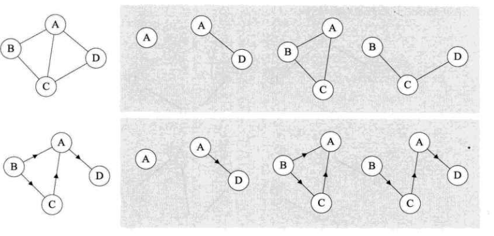

# 7. 图  

## 7.1 图的定义 

&emsp;&emsp;在线性表中，数据元素之间是被串起来的，仅有线性关系，每个数据元素只有一个直接前驱和一个直接后继。在树形结构中，数据元素之间有着明显的层次关系，并且每一层上的数据元素可能和下一层中的多个元素相关，但只能和上一层中一个元素相关。这和一对父母可以有多个孩子，但每个孩子却只能有一对父母是一个道理。可现实中，人与人之间关系就非常复杂，比如我认识的朋友，可能他们之间也互相认识，这就不是简单的一对一、一对多，研究人际关系很自然会考虑多对多的情况。那就是图。图是一种较线性表和树更加复杂的数据结构。在图形结构中，结点之间的关系可以是任意，图中任意两个数据元素之间都可能相关（如图7.1）。  

<div align="center"></div>

> 图(Graph)是由顶点的有穷非空集合和顶点之间边的集合组成，通常表示为：G(V,E)，其中，G表示一个图，V是图G中顶点的集合，E是图G中边的集合。

&emsp;&emsp;对于图的定义，我们需要明确几个注意的地方

- 线性表中我们把数据元素叫元素，树中将数据元素叫结点，在图中数据元素，我们则称之为顶点(Vertex)。  
- 线性表中可以没有数据元素，称为空表。书中可以没有结点，叫做空树。那么对于图呢？在图结构中，不允许没有顶点。在定义中，若V是顶点的集合，则强调了顶点集合V有穷非空
- 线性表中，相邻的数据元素之间具有线性关系，树结构中，相邻两层的结点具有层次关系，而<b>图中，任意两个顶点之间都可能有关系，顶点之间的逻辑关系用边来表示，</b>边集可以是空的。  

### 7.1.1 各种图定义  

&emsp;&emsp;<b>无向边：若顶点V~i~到V~j~之间的边没有方向，则称这条边为无向边(Edge)，用无序偶对(V~i~,V~j~)来表示。</b>如果图中任意两个顶点之间的边都是无向边，则称该图为无向边(Undirected graphs)。图7.2左图就是一个无向图，由于是无方向的，连接顶点A与D的边，可以表示成无序对(A,D)，也可以写成(D,A)</b>。  
&emsp;&emsp;对于图7.2左图的无项图G~1~来说，G~1~ = (V~1~,{E~1~})，其中顶点集合V~1~={A,B,C,D};边集合E~1~={(A,B),(B,C),(C,D),(D,A),(A,C)}  

<div align="center"></div>

&emsp;&emsp;<b>有向边：若从顶点V~i~到V~j~的边有方向，则称这条边为有向边，也称为弧(Arc)</b>。用有序偶<V~i~,V~j~>来表示，V~i~称为弧尾(Tail)，V~j~称为弧头(Head)。如果图中任意两个顶点之间的边都是有向边，则称该图为有向图(Directed graphs)。图7.2右图就是一个有向图。<b>连接顶点A到D的有向边就是弧，A是弧尾，D是弧头，<A,D>表示弧，注意不能写成<D,A>。</b>  

&emsp;&emsp;对于图7.2右图中的有向图G~2~来说，G~2~=(V~2~,{E~2~})，其中顶点集合V~2~={A,B,C,D}；弧集合E~2~={<A,D>,<B,A>,<C,A>,<B,C>}。<b>无向边用小括号“（）”表示，而有向边则是用尖括号“<>”表示</b>。  
&emsp;&emsp;<b>在图中，若不存在顶点到其自身的边，且同一条边不重复出现，则称这样的图为简单图。</b>  
&emsp;&emsp;<b>在无向图中，如果任意两个顶点之间都存在边，则称该图为无向完全图。</b>含有n个顶点的无向完全图有n*(n-1)/2条边。比如图7.3就是无向完全图，因为每个顶点都要与除它以外的顶点连线，顶点A与BCD三个顶点连线，共有4个顶点，从4个选出两个进行匹配就是C${ n \choose 2}$，如图7.3所示：  

<div align="center"></div>

&emsp;&emsp;<b>在有向图中，如果任意两个顶点之间都存在方向互为相反的两条弧，则称该图为有向完全图。</b>含有n个顶点的有向完全图有n*(n-1)条边，如图7.4所示：  

<div align="center"></div>  

&emsp;&emsp;从这里也可以得到结论，对于具有n个顶点和e条边数的图，无向图0<e<=(n-1)/2，有向图0<e<=n(n-1)  
&emsp;&emsp;<b>有很少条边或弧的图称为稀疏图，反之称为稠密图。</b>有些图的边或弧具有与它相关的数字，这种<b>与图的边或弧相关的数叫做权(Weight)。</b>这些权可以表示从一个顶点到另一个顶点的距离或耗费。这种<b>带权的图通常为网(Network)</b>。图7.5所示就是一张带权的图，即标识中国四大城市的直线距离的网，此图中的权就是两地的距离。  

<div align="center"></div>  

&emsp;&emsp;<b>假设有两个图G=(V,{E})和G'=(V,{E}),如果V'$\subseteq$V且E'$\subseteq$E，则称G'为G的子图(Subgraph)。</b>如图7.6所示:  

<div align="center"></div>

### 7.1.2 图的顶点与边间关系  
&emsp;&emsp;<b>对于无向图G=(V,{E}),如果边(v,v')$\in$E，则称顶点v和v'互为邻接点(Adjacent)，即v和v'相邻接。边(v,v')依附(incident)于顶点v和v'，或者说(v,v')与顶点v和v'相关联。顶点v的度(Degree)是和v相关联的边的数目，记为TD(v)</b>。例如图7.6左侧上方的无向图，顶点A与B互为邻接点，边(A,B)依附于顶点A与B上，顶点A的度为3.而此图的边数是5，各个顶点度的和=3+2+3+2=10，推敲后发现，边数其实就是各顶点度数和的一半，多出的一半是因为重复两次记数。简记之，<font color=red>e=1/2$\sum_{i=1}^n$TD(v~i~)</font>。  
&emsp;&emsp;<b>对于有向图G=(V,{E}),如果弧<v,v'>$\in$E，则称顶点v邻接到顶点v'，顶点v'邻接自顶点v。弧<v,v'>和顶点v,v'相关联。以顶点v为开头的弧的数目称为v的入度(InDegree)，记作ID(v)；以v为尾的弧的数目称为v的出度(OutDegree)，记为OD(v)；顶点v的度为TD(v) = ID(v) + OD(v)</b>。例如图7.6左侧下方的有向图，顶点A的入度是2(从B到A的弧，从C到A的弧)，出度是1(从A到D的弧)，所以顶点A的度为2+1=3。此有向图的弧有4条，而各顶点的出度和=1+2+1+0=4，各顶点的入度和=2+0+1+1=4.所以得到<font color=red>e= $\sum_{i=1}^n$ID(v~i~) = $\sum_{i=1}^n$OD(v~i~)。</font>  
&emsp;&emsp;无向图G=(V,{E})中从顶点v到顶点v'的路径(Path)是一个顶点序列(v=v~i,0~,v~i,1~,...,v~i,m~=v')，其中(v~i,j-1~,v~i,j~)$\in$E，1<=j<=m。例如图7.7所示就列举另外顶点B到顶点D四种不同的路径:  

<div align="center"></div>  

&emsp;&emsp;如果G是有向图，则路径也是有向的，顶点序列应满足<V~i,j-1~,V~i,j~>$\in$E，1<=j<m。例如图7.8，顶点B到D有两种路径。  

<div align="center"></div>  

&emsp;&emsp;如果G是有向图，则路径也是有向的，顶点序列应满足<V~i,j-1~,V~i,j~>$\in$E,1<=j<m，顶点B到D有两种路径。而顶点A到B，就不存在路径。如图7.9所示  

<div align="center"></div>  

&emsp;&emsp;树中根结点到任意结点的路径是唯一的，但是图中顶点与顶点之间的路径却是不唯一的。  
&emsp;&emsp;<b>路径的长度是路径上的边或弧的数目。</b>图7.8中左侧两条路的长度为2，右侧两条路径长度为3。图7.9中左侧路径长为2，右侧路径长度为3。  
&emsp;&emsp;<b>第一个顶点到最后一个顶点相同的路径称为回路或环(Cycle)。序列中顶点不重复出现的路径称为简单路径。除了第一个顶点和最后一个顶点之外，其余顶点不重复出现的回路，称为简单回路或简单环。</b>图7.10中两个图的粗线都构成环，左侧的环因第一个顶点和最后一个顶点都是B，且C、D、A没有重复出现，因此是一个简单环。而右侧的环，由于顶点C的重复，它就不是简单环了。  

<div align="center"></div>

### 7.1.3 连通图相关术语  

&emsp;&emsp;<b>在无向图G中，如果从顶点v到顶点v'有路径，则称v和v'是连通的。如果对于图中任意两个顶点v~i~，v~j~$\in$E,v~i~和v~j~都是连通的，则称G是连通图(Connected Graph)。</b>图7.11图的图1，它的顶点A到顶点B、C、D、都是连通的，但显然A与顶点E或F就无路径，因此不能算是连通图。而图7.11中的图2，定点A、B、C、D相互都是连通的，所以它本身是连通图。  

<div align="center"></div>

&emsp;&emsp;<b>无向图中的极大连通子图称为连通分量。</b>注意联通分量的概念，它强调：  
- 要是子图；
- 子图要是连通的；
- 连通子图含有极大顶点数；
- 具有极大顶点数的联通子图包含依附于这些顶点的所有边。  

&emsp;&emsp;<b>在有向图G中，如果对于每一对v~i~，v~j~$\in$V、v~i~不等于v~j~，从v~i~到v~j~和从v~j~到v~i~都存在路径，则称G是强连通图。有向图中的极大强连通子图称做有向图的强连通分量。</b>例如图7.12，图1并不是强连通图，因为顶点A到顶点D存在路径，而D到A就只存在。图2就是强连通图，而且显然图2是图1的极大强连通子图，既是它的强连通分量。  

<div align="center"></div>

&emsp;&emsp;现在查看连通图的生成树定义。  
&emsp;&emsp;所谓的一个<b>连通图的生成树是一个极小的连通子图。它含有图中全部的n个顶点，但只有足以构成一棵树的n-1条边</b>。比如图7.13的图1是一普通图，但显然它不是生成x树，当去掉两条构成环的边后，比如图2和图3，就满足n个顶点n-1条边且联通的定义了。它们都是一棵生成树。从这里也知道，如果一个图有n个顶点n-1条边和小于n-1条边，则是非连通图，如果它多于n-1条边，必定构成一个环，因为这条边使得它依附的那个顶点之间有了第二条路径。比如图2和图3,随便加哪两个顶点的边都将构成环。不过有n-1条边并不一定是生成树，比如图4。 

<div align="center"></div>

&emsp;&emsp;<b>如果一个有向图恰好有一个顶点的入度为0,其余顶点的入度均为1,则是一棵有向树。</b>对有向树的理解也比较容易，所谓入度为0其实 就相当于树中的根结点，其余顶点入度为1就是说树的非根结点的双亲只有一个。一个<b>有向图的生成森林由若干棵有向树组成，含有图中全部顶点，但只有足以构成若干棵不相交的有向树的弧。</b>如7.14图的图1是一棵有向图。去掉一些弧后，它可以分解为两棵有向树，如图2、3,这两棵就是图1有向图的生成森林。  

<div align="center"></div>

### 7.1.4 图的定义与术语总结

&emsp;&emsp;<font color=red>图</font>按照有无方向分为<font color=blue>无向图和有向图</font>。无向图由<font color=red>顶点和边构成</font>，有向图由<font color=red>顶点和弧</font>构成。弧有<font color=blue>弧尾和弧头之分</font>。  
&emsp;&emsp;图按照边或弧的多少分<font color=blue>稀疏图和稠密图</font>。如果任意两个顶点之间都存在边叫<font color=blue>完全图</font>，有向的叫<font color=blue>有向完全图</font>。若无重复的边或顶点到自身的边则叫<font color=blue>简单图</font>。  
&emsp;&emsp;图中顶点之间有<font color=blue>邻接点、依附</font>的概念。无向图顶点的边数叫做<font color=blue>度</font>，有向图顶点分为<font color=blue>入度和出度</font>。  
&emsp;&emsp;图上的边或弧上<font color=blue>带权则称为网</font>。  
&emsp;&emsp;图中顶点间存在<font color=blue>路径</font>，两顶点存在路径则说明是<b>连通</b>的，如果路径最终回到起始点则称为<font color=blue>环</font>，当环中不重复叫<font color=blue>简单路径</font>。若任意两顶点都是<b>连通</b>的，则图就是<font color=blue>连通图</font>，有向则称为<font color=blue>强连通图</font>。图中有子图，若子图极大连通则就是<font color=blue>连通分量</font>，有向的则称<font color=blue>强连通分量</font>。  
&emsp;&emsp;无向图中连通且n个顶点n-1条边叫做<font color=blue>生成树</font>，有向图中一顶点入度为0其余顶点入度为1的叫<font color=blue>有向树</font>。一个有向图由若干棵有向树构成生成<font color=blue>森林</font>。


## 7.2 图的抽象数据类型  

&emsp;&emsp;图作为一种数据结构，它的抽象类型带有自己特点，正因为它的复杂，运用广泛，使得不同的应用需要不同的运算集合，构成不同的数据操作。

```
ADT 图(Graph)

Operation
    CreateGraph(*G,V,VR):按照顶点集V和边弧集VR的定义构造图G
    DestroyGraph(*G):图G存在则销毁  
    LocateVex(G,u):若图G中存在顶点u，则返回图中的位置
    GetVex(G,v):返回图G中顶点v的值
    PutVex(G,v,value):将图G中顶点v赋值value
    FirstAdjVex(G,*v)：返回顶点v的一个邻接顶点，若顶点在G中无邻接顶点返回空
    NextAdjVex(G,v*w):返回顶点v相对于顶点w的下一个邻接顶点，若w是v的最后一个邻接点则返回“空”
    InsertVex(*G,v):在图G中增添新顶点v
    DeleteArc(*G,v):删除图G中顶点v及其相关的弧
    InsertArc(*G,v,w):在图G中增添弧<v,w>，若G是无向图，还需要增添对称弧<w,v>
    DeleteArc(*G,v,w):在图G中删除弧<v,w>,若G是无向图，则还删除对称弧<w,v>
    DESTraverse(G):对图G中进行深度优先遍历，在遍历过程中对每个顶点调用
    HFSTraverse(G):对图G中进行广度优先遍历，在遍历过程中对每个顶点调用
endADT
```

## 7.3 图的存储结构  

&emsp;&emsp;图的存储结构相较线性表与树来说就更加复杂了。首先，我们口头上说的“顶点的位置”或“邻接点的位置”只是一个相对的概念。其实从图的逻辑结构定义来看，图上任何一个顶点都可被看成是第一个顶点，任一顶点的邻接点之间也不存在次序关系。比如图7.15中的四张图，仔细观察发现，它们其实是同一个图，只不过顶点的位置不同，就造成了表象上不太一样的感觉。  

<div align="center"></div>

&emsp;&emsp;也正由于图的结构比较复杂，任意两个顶点之间都可能存在联系，因此无法以数据元素在内存中的物理位置来表示元素之间的关系，也就是说，图不可能用简单的顺序存储结构来表示。而多重链表的方式，即以一个数据域和多个指针域组成的结点表示图中的一个顶点，尽管可以实现图结构，但其实在树中，我们也已经讨论过，这是有问题的。如果各个顶点的度数相差很大，按度数最大的顶点设计结点结构会造成很多存储单元的浪费，而若按每个顶点自己的度数设计不同的的顶点结构，又带来操作的不便。因此，对于图来说，如何对它实现物理存储是个难题，不过我们的前辈们已经解决了，现在我们来看看前辈们提供的五种不同的存储结构。  

### 7.3.1 邻接矩阵  

&emsp;&emsp;考虑到图是由顶点和边或弧两部分组成。合成一起比较困难，那就很自然地考虑到分两个结构来分别存储。顶点不分大小、主次，所以用一个一维数组来存储是很不错的选择。而边或弧由于是顶点与顶点之间的关系，一维搞不定，那就考虑用一个二维数组来存储。于是我们的邻接矩阵的方案就诞生了。  

&emsp;&emsp;<b>图的邻接矩阵(Adjacency Matrix)存储方式是用两个数组来表示图。一个一维数组存储图中顶点信息，一个二维数组(称为邻接矩阵)存储图中的边或弧的信息。</b>  
&emsp;&emsp;设图G有n个顶点，则邻接矩阵是一个nxn的方阵，定义为:arc[i][j] = 1,若(v~i~,v~j~)$\in$E或<v~i~,v~j~>$\in$E。arc[i][j] = 0，则相反。我们来看一个实例，图7.16的左图。  

<div align="center"></div>

&emsp;&emsp;我们可以设置两个数组，顶点数组为vertex[4]={v~0~,v~1~,v~2~,v~3~}，边数组arr[4][4]为图7.16右图这样的一个矩阵。简单解释一下，对于矩阵的主对角线的值，即arc[0][0]、arc[1][1]、arc[2][2]、arc[3][3]，全为0是因为不存在顶点到自身的边，比如v~0~到v~0~。arc[0][1]=1是因为v~0~到v~1~的边存在，而arc[1][3]=0是因为v~1~到v~3~的边不存在。并且由于是无向图，v~1～到v~3~的边不存在，意味着v~3~到v~1~的边也不存在。所以无向图的边数组是一个对称矩阵。  
&emsp;&emsp;嗯？对称矩阵是什么？忘记了不要紧，复习一下。所谓对称矩阵就是n阶矩阵的元满足a~ij~=a~ji~，（0<=i,j<=n）。即从矩阵的左上角到右下角的主对角线为轴，右上角的元与左下角相对应的元全都是相等的。  
&emsp;&emsp;有了这个矩阵，我们就可以很容易地知道图中的信息。  
1. 我们要判定任意两顶点是否有边无边就非常容易了。  
2. 我们要知道某个顶点的度，其实就是这个顶点v~i在邻接矩阵中第i行（或第i列）的元素之和。比如顶点v~i~的度就是1+0+1+0=2。
3. 求顶点v~i~的所有邻接点就是将矩阵中第i行元素扫描一遍，arc[i][j]为1即是1邻接点。  

&emsp;&emsp;我们再来看一个有向图样例，如图7.17所示左图：  

<div align="center"></div>

&emsp;&emsp;顶点数组为vertex[4]={v~0~,v~1~,v~2~,v~3~}，弧数组arc[4][4]为图7.17右图这样的一个矩阵。主对角线上数值依然为0.但因为是有向图，所以此矩阵并不对称，比如由v~1~到v~0~有弧，得到arc[1][0]=1，而v~0~到v~1~没有弧，因此arc[0][1]=0。  
&emsp;&emsp;有向图讲究入度与出度，顶点v~1~的入度为1,正好是第v~1~列各数之和。顶点v~1~的出度为2,即第v~1~行各数的和。  
&emsp;&emsp;与无向图同样的方法，判断顶点v~i~到v~j~是否存在弧，只需要查找矩阵中arc[i][j]是否为1即可。  
 &emsp;&emsp;在图的术语中，我们提到了网的概念，也就是每条边上带有权的图叫做网。那么这些权值就需要存下来，如何处理这个矩阵来适应这个需求呢？我们有办法。  
 &emsp;&emsp;设图G是网图，有n个顶点，则邻接矩阵是一个nxn的方阵，定义为: arc[i][j] = W~ij~,若(v~i~,v~j~)$\in$E或<v~i~,v~j~>$\in$E； 若i = j,arc[i][j] = 0;反之 arc[i][j] = $\infin$。  
 &emsp;&emsp;这里W~ij~表示(v~i~,v~j~)或者<v~i~,v~j~>上的权值。$\infin$表示一个计算机允许的、大于所有边上权值的值，也就是一个不可能的极限值。有同学会问，为什么不是0呢？原因在于权值w~ij~大多数情况写是正值，但个别时候可能就是0,甚至有可能是负值。因此必须要用一个不可能的值来代表不存在。如图7.18左图就是一个有向网图，右图就是它的邻接矩阵。  

<div align="center"></div>  

&emsp;&emsp;那么邻接矩阵是如何实现图的创建的呢？我们先来看看图的邻接矩阵存储的结构，代码如下。  
```
typedef char VertexType;            /*顶点类型应由用户定义*/
typedef int EdgeType;               /*边上的权值类型应由用户定义*/
#define MAXVEX 100;                 /*最大顶点数，应由用户定义*/
#define INFINITY 65535              /*用65535代表无穷大*/

typedef struct
{
    VertextType vexs[MAXVEX];       /*顶点表*/
    EdgeType arc[MAXVEX][MAXVEX];   /*邻接矩阵，可看作边表*/
    int numVertexes, numEdges;      /*图中当前的顶点数和边数*/
}MGraph;
```
&emsp;&emsp;有了这个结构定义，我们构造一个图，其实就是给顶点表和边表输入数据的过程。我们来看看无向网图的创建代码。  
```
/*建立无向网图的邻接矩阵表示*/
void CreateMGraph(MGraph *G)
{
    int i,j,k,w;
    printf("输入顶点数和边数:\n");
    scanf("%d,%d",&G->numVertexes,);    /*输入顶点数和边数*/
    for(i = 0, i < G->numVertexes; i++) /*读入顶点信息，建立顶点表*/
    {
        scanf(&G->vexs[i]);
    }
    for(i  = 0; i< G->numVertexes; j++)
    {
        for(j = 0; j< G->numVertexes; j++)
        {
            G->arc[i][j] = INFINITY;    /*邻接矩阵初始化*/
        }
    }

    for(k = 0; k < G->numEdges; k++)    /*读入numEdges条边，建立邻接矩阵*/
    {
        printf("输入边(Vi,Vj)上的下标i,下标j和权w:\n");
        scanf("%d,%d,%d",&i,&j,&w);     /*输入边(vi,vj)上的权w*/
        G->arc[i][j] = w;
        G->arc[j][i] = G->arc[i][j];    /*因为是无向图，矩阵对称*/
    }
}
```

&emsp;&emsp;从代码中也可以得到，n个顶点和e条边的无向网图的创建，时间复杂度为O(n+n^2^+e)，其中对邻接矩阵Garc的初始化耗费了O(n^2^)的时间。  

### 7.3.2 邻接表  

&emsp;&emsp;邻接矩阵是不错的一种图存储结构，但是我们发现，对于边数相对顶点较少的图，这种结构是存在对存储空间的极大浪费的。比如说，如果我们要处理图7.19这样的稀疏有向图，邻接矩阵除了arc[1][0]有权值外，没有其他弧，其实这些存储空间都浪费了。  

<div align="center"></div>  

&emsp;&emsp;因此我们考虑另外一种存储结构方式。回忆我们在线性表时谈到，顺序存储结构就存在预先分配内存可能造成存储空间浪费的问题，于是引出了链式存储的结构。同样的，我们也可以考虑对边或弧使用链式存储的方式来避免空间浪费的问题。  
&emsp;&emsp;再回忆我们在树中谈存储结构时，讲到了一种孩子表示法，将结点存入数组，并对结点的孩子进行链式存储，不管有多少孩子，也不会存在空间浪费问题，这种思路同样适用于图的存储。我们把这种<b>数组与链表相结合的存储方法称为邻接表(Adjacency List)</b>。  
&emsp;&emsp;邻接表的处理办法是这样。  
1. 图中顶点用一个一维数组存储，当然，顶点也可以用单链表来存储，不过数组可以较容易地读取顶点信息，更加方便。另外，对于顶点数组中，每个数据元素还需要存储指向第一个邻接点的指针，以便于查找该顶点的边信息。  
2. 图中每个顶点v~i~的所有邻接点构成一个线性表，由于邻接点的个树不定，所以用单链表存储，无向图称为顶点v~i~的边表，有向图则称为顶点v~i~作为弧尾的出边表。  

&emsp;&emsp;例如图7.20所示的就是一个无向图的邻接表结构。  

<div align="center"></div>  

&emsp;&emsp;从图中我们知道，顶点表的各个结点由data和firstedge两个域表示，data是数据域，存储顶点的信息，firstefge是指针域，指向边表的第一个结点，即此顶点的第一个邻接点。边表结点由adjvex和next两个域组成。adjvex是邻接点域，存储某顶点的邻接点在顶点表中的下标，next则存储指向边表中下一个结点的指针。比如v~1~顶点与v~0~、v~2~互为邻接点，则在v~1~的边表中，adjvex分别为v~0~的0和v~2~的2。  
&emsp;&emsp;这样的结构，对于我们要获得图的相关信息也是很方便的。比如我们要想知道某个顶点的度，就去查找这个顶点的边表中结点的个数。若要判断顶点v~i~到v~j~是否存在边，只需要测试顶点v~i~的边表中adjvex是否存在结点v~j~的下标j就行了。若求顶点的所有邻接点，其实就是对此顶点的边表进行遍历，得到的adjvex域对应的顶点就是邻接点。  
&emsp;&emsp;若是有向图，邻接表结构是类似的，比如图7.21中第一幅图的邻接表就是第二幅图。但需要注意的是有向图由于由方向，我们是以顶点为弧尾来存储边表的，这样很容易就可以得到每个顶点的出度。但也有时为了便于确定顶点的入度或以顶点为弧头的弧，我们可以<b>建立一个有向图的逆邻接表，即对每个顶点v~i~都建立一个链接为v~i~为弧头的表</b>。如图7.21的第三幅图所示。  

<div align="center"></div>  

&emsp;&emsp;此时我们很容易就可以算出某个顶点的入度或出度是多少，判断两顶点是否存在弧也很容易实现。  
&emsp;&emsp;对于带权值的网图，可以在边表结点定义中再增加一个weight的数据域，存储权值信息即可，如图7.22所示。  

<div align="center"></div>  

&emsp;&emsp;有了这些结构的图，下面关于结点定义的代码就很好理解了。  

```
typedef char VertexType;            /*顶点类型应由用户定义*/
typedef int EdgeType;               /*边上的权值类型应由用户定义*/

typedef struct EdgeNode             /*边表结点*/
{
    int adjvex;                     /*邻接点域，存储该顶点对应的下标*/
    EdgeType weight;                /*用于存储权值，对于非网图可以不需要*/
    struct EdgeNode *next;          /*链域，指向下一个邻接点*/
}EdgeNode;

typedef struct VertexNode           /*顶点表结点*/
{
    VertexType data;                /*顶点域，存储顶点信息*/
    EdgeNode *firstedge;            /*边表头指针*/
}VertexNode,AdjList[MAXVEX];

typedef struct
{
    AdjList adjList;
    int numVertexes,numEdges;       /*图中当前顶点数和边数*/
}GraphAdjList;
```

&emsp;&emsp;对于邻接表的创建，也就是顺理成章之事。无向图的邻接表创建代码如下。  

```
/*建立图的邻接表结构*/
void CreateALGraph(GraphAdjList *G)
{
    int i,j,k;
    EdgeNode *e;
    printf("请输入顶点数和边数:\n");
    scanf("%d,%d",&G->numVertexes, &G->numEdges);       /*输入顶点数和边数*/
    for(i = 0; i< G->numVertexes; i++)
    {
        scanf("输入顶点信息: %d",&G->adjList[i].data);
        G->adjList[i].firstedge = NULL;                 /*将边表置为空表*/
    }

    for(k = 0; k< G->numEdges; k++)                     /*建立边表*/
    {
        printf("输入边(Vi,Vj)上的顶点序号:\n");
        scanf("%d,%d",&i,&j);                           /*输入边(Vi,Vj)上的顶点序号*/
        e = (EdgeNode *)malloc(sizeof(EdgeNode));       /*向内存申请空间，生成边表结点*/
        e->adjvex=j;                                    /*邻接序号为j*/
        e->next=G->adjList[i].firstedge;                /*将e指针指向当前顶点指向的结点*/
        G->adjList[i].firstedge = e;                    /*将e指针指向当前顶点指向的结点*/
        e = (EdgeNode *)malloc(sizeof(EdgeNode));       /*向内存申请空间，生成边表结点*/
        e->adjvex = i;                                  /*邻接序号为i*/
        e->next=G->adjList[j].firstedge;                /*将e指针指向当前顶点指向的结点*/
        G->adjList[j].firstedge = e;                    /*将当前顶点的指针指向e*/
    }

}
```

&emsp;&emsp;从申请空间开始的代码，是应用了我们在单链表创建中讲解的头插法。由于对于无向图，一条边对应都是两个顶点，所以在循环中，一次就针对i和j分别进行了插入。本算法的时间复杂度，对于n个顶点e条边来说，很容易得出是O(n+e)。  

### 7.3.3 十字链表  

&emsp;&emsp;对于有向图来说，邻接表是有缺陷的。关心了出度问题，想了解入度就必须要遍历整个图才能知道，反之，逆邻接表解决了入度却不了解出度的情况。有没有可能把</b>邻接表与逆邻接表结合起来</b>呢？答案是肯定的，就是把它们整合在一起，这就是我们现在要江的有向图的一种存储方法：<b>十字链表(Orthogonal List)</b>。  
&emsp;&emsp;我们重新定义定点表结点结构如下所示：  

<table sysle="margin:0 auto;">
    <tr>
        <th>data</th>
        <th>firstin</th>
        <th>firstout</th>
    </tr>
</table>


&emsp;&emsp;其中firstin表示入边表头指针，指向该顶点的入表边中第一个结点，firstout表示出表头指针，指向该顶点的出表边中的第一个结点。  
&emsp;&emsp;重新定义的边表结点结构如下：  


<table sysle="margin:0 auto;">
    <tr>
        <th>tailvex</th>
        <th>headvex</th>
        <th>headlink</th>
        <th>taillink</th>
    </tr>
</table>

&emsp;&emsp;其中tailvex是指弧起点在顶点表的下标，headvex是指弧终点在顶点表中的下标，headlink是指入边表指针域，指向终点相同的下一条边，taillink是指边表指针域，指向起点相同的下一条边。如果是网，还可以再增加一个wegiht域来存储权值。  
&emsp;&emsp;比如图7.23，顶点依然是存入一个一维数组{v~0~,v~1~,v~2~,v~3~},实线箭头指针的图示完全与图7.21的邻接表相同。就以顶点v~0~来说，firstout指向的是出边表中的第一个结点v~3~。所以v~0~边表结点的headvex=3，而tailvex其实就是当前顶点v~0~边表结点的下标0，由于v~0~只有一个出边顶点，所以headlink和taillink都是空。   

<div align="center"></div>  

&emsp;&emsp;我们重点需要解释虚线箭头的含义，它其实就是此突的逆邻接表的表示。对于v~0~来说，它有两个顶点v~1~和v~2~的入边。因此v~0~的firstin指向顶点v~1~的边表结点中headvex为0的结点，如图7.23右图的1。接着由入边结点的headlink指向下一个入边顶点v~2~，如图2.对于顶点v~1~，它有一个入边顶点v~2~，所以它的finsitin指向顶点v~2~的边表结点中headvex为1的结点，如图中的3。顶点v~2~和v~3~也是同样有一个入边顶点，如图中4和5。  
&emsp;&emsp;十字链表的好处就是因为把邻接表和逆邻接表整合在了一起，这样既容易找到以v~i~为尾的弧，也很容易找到以v~i~为头的弧，因而容易求得顶点的出度和入度。而且它除了结构复杂一点外，其实创建图算法时间复杂度和邻接表相同的，因此，在有向图中，十字链表是非常好的数据结构模型。  

### 7.3.4 邻接多重表 

&emsp;&emsp;讲了有向图的优化存储结构，对于无向图的邻接表，有没有问题呢？如果我们在无向图的应用中，关注的重点是顶点，那么邻接表是不错的选择，但如果我们更关注边的操作，比如对已访问国的边做标记，删除某一条边等操作，那就意味着，需要找到这条边的两个边表结点进行操作，这其实还是比较麻烦的。比如图7.24，若要删除左图的(v~0~,v~2~)这条边，需要对邻接表结构中右边表的阴影两个结点进行删除操作，显然这是比较繁琐的。  

<div align="center"></div>  

&emsp;&emsp;因此，我们也仿照十字链表的方式，对边表结点的结构进行一些改造，也许就可以避免刚才提到的问题。  
&emsp;&emsp;重新定义的边表结点结构如表所示:  

<table sysle="margin:0 auto;">
    <tr>
        <th>ivex</th>
        <th>ilink</th>
        <th>jvex</th>
        <th>jlink</th>
    </tr>
</table>

&emsp;&emsp;其中<b>ivex和jvex是与某条边依附的两个顶点在顶点表中下标。ilink指向依附定点ivex的下一条边，jlink指向依附顶点jvex的下一条边。这就是邻接多重表结构</b>。  


### 7.3.5 边集数组  

&emsp;&emsp;边集数组是由两个一维数组构成。一个存储顶点的信息；另一个是存储边的信息，这个边数组每个数据元素由一条边的起点下标(begin)、终点下标(end)和权(weight)组成，如图7.25所示。显然边集数组关注的是边的集合，在边集数组中要查找一个顶点的度需要扫描整个边数组，效率并不高。因此它更适合对边依次进行处理的操作，而不适合对顶点相关的操作。关于边集数组的应用后面在克鲁斯卡尔(Kruskal)算法中有介绍。  

<div align="center"></div>  


## 7.4 图的遍历  

&emsp;&emsp;图的遍历是和树的遍历类似，我们需要<b>从图中某一顶点出发遍寻图中其余顶点，且使每一个顶点仅被访问一次，这一过程就叫做图的遍历(Traversing Graph)</b>。  
&emsp;&emsp;树的遍历我们谈到了四种方案，应该说都还好。毕竟根结点只有一个，遍历都是从它发起的，其余所有结点都只有一个双亲，可图就复杂多了，因为它的任一定点都可能和其余的所有顶点相邻接，极有可能存在沿着某条路径搜索后，又回到原顶点，而有些顶点却还没有遍历到的情况。因此我们需要在遍历过程中把访问过的顶点打上标记，以避免访问多次而不自知。具体方法是设置一个访问数组visited[n]，n是图中顶点的个数，初值为0，访问过后设置为1。  
&emsp;&emsp;对于图的遍历来说，如何避免因回路陷入死循环，就需要科学地设计遍历方案，通常有两种遍历次序方案：它们是<b>深度优先遍历和广度优先遍历</b>。  
 
 ### 7.4.1 深度优先遍历  

&emsp;&emsp;深度优先遍历(Depth_First_Search)，也有被称为深度优先搜索，简称DFS。假设需要完成一个任务，要求7.26左图这样的一个迷宫中，从顶点A开始要走遍所有的图顶点并作上标记，注意不是简单地看着这样的平面图走，而是如同现实般地只有高墙和通道的迷宫中去完成任务。  

<div align="center"></div>    

&emsp;&emsp;很显然我们是需要策略的，否则在这四通八达的通道中乱窜，要想完成任务那就只能碰运气。如果你学过深度优先遍历，这个任务就不难完成了。  
&emsp;&emsp;首先我们从顶点A开始，做上表示走过的记号后，面前有两条路，通向B和F，我们给自己定一个原则，在没有碰到重复顶点的情况下，始终是向右手边走，于是走到了B顶点。整个行路过程，可以参看图7.26的右图。此时发现有三条分支，分别通向顶点C、I、G，右手通行原则，使得我们走到了C顶点。就这样，我们一直顺着右手通道走，一直走到了F定点。当我们依然选择右手通道走过去之后，发现走回到顶点A了，因为在这里做了记号表示已经走过了。此时我们退回顶点F，走向从右数的第二条通道，到达了G顶点，它有三条通道，发现B和D都已经是走过的，于是走到H，当我们面对通向H的两条通道D和E时，会发现都已经走过了。  
&emsp;&emsp;此时我们是否已经遍历了所有顶点呢？没有，可能还有很多分支的顶点我们没有走到，所以我们按原路返回。在顶点H处，再无通道走过，返回到G，也无未走过通道，返回到F，没有通道，返回到E，有一条通往H的通道。验证后也是走过的，再返回顶点D，此时还有三条道未走过，一条条来，H走过了，G走过了，I这是一个新顶点，没有标记，记下来。继续返回，直到返回顶点A，确认你已经完成遍历所有任务，找到了所有的9个顶点。  
&emsp;&emsp;8反应快的同学一定会感觉到，深度优先遍历其实就是一个递归的过程。如果再敏感一些，会发现其实转换成如图7.26右图所示，就像是一棵树的前序遍历，没错，它就是。它从图中某个顶点v出发，访问此顶点，然后从v的未被访问的邻接点出发深度优先遍历图，直至图中所有和v有路径相通的顶点都被访问到。事实上，我们这里讲到的是连通图，对于非连通图，只需要对它的连通分量分别进行深度优先遍历，即在先前一个顶点进行一次深度优先遍历后，若图中尚有顶点未被访问，则另选图中一个未曾访问的顶点作起始点，重复上述过程，直至图中所有顶点都被访问到为止。  
&emsp;&emsp;如果我们用的是邻接矩阵的方式，则代码如下：  

```
typedef int Boolean;            /*Boolean 是布尔类型，其值是TRUE或FALSE*/
Boolean visited[MAX];           /*访问标志的数组*/

/*邻接矩阵的深度优先递归算法*/

void DFS(MGraph G, int i)
{
    int j;
    visited[i] = TRUE;
    printf("%c", G.vexs[i]);    /*打印顶点，也可以做其他操作*/
    for(j = 0; j < G.numVertexes; j++)
    {
        if(G.arc[i][j] == 1 && !visites[j])
        {
            DFS[G,j];           /*对访问的邻接顶点递归调用*/
        }
    }
}

/*邻接矩阵的深度遍历操作*/
void DFSTraverse(MGraph G)
{
    int i;
    for(i = 0; i<G.numVertexes; i++)
    {
        visited[i] = FALSE;     /*初始所有顶点状态都是来访问过状态*/
    }
    for( i = 0; i<G.numVertexes; i++)
    {
        if(!visited[i]) /*对未访问国的顶点调用DFS，若是连通图，指挥执行一次*/
        {
            DFS(G,i);
        }
    }
}
```

&emsp;&emsp;对比两个不同存储结构的深度优先遍历算法，对于n个顶点e条边的图来说，邻接矩阵由于是二维数组，要查找每个顶点的邻接点需要访问矩阵中的所有元素，因此都需要O(n~2~)的时间。而邻接表做存储结构时，找邻接点所需要的时间取决于顶点和边的数量，所以是O(n+e)。显然对于点多边少的稀疏图来说，邻接表结构使得算法在时间效率上大大提高。  
&emsp;&emsp;对于有图而言，由于它只是对通道存在可行或不可行，算法上没有变化，是完全可以通用的。  


### 7.4.2 广度优先遍历


&emsp;&emsp;广度优先遍历(Breadth_First_Search)，又称为广度优先搜索，简称BFS。如果说图的深度优先遍历类似树的前序遍历，那么图的广度优先遍历就类似于树的层序遍历了。我们将图7.26的第一幅图稍微变形，变形原则是顶点A放置在最上第一层，让与它有边的顶点B、F为第二层，再让与B和F有边的顶点C、I、G、E为第三层，再将这四个顶点有边的D、H放在第四层，如图7.27的第二幅图所示。此时在视觉上感觉图的形状发生了变化，其实顶点和边的关系还是完全相同的。  

<div align="center"></div>    

&emsp;&emsp;有了这个讲解，我们来看代码就非常容易了。以下是邻接矩阵结构的广度优先遍历算法。  

```
/*邻接矩阵的广度遍历算法*/
void BFSTraverse(MGraph G)
{
    int i, j;
    Queue Q;
    for(i = 0; i < G.numVertexes; i++)
    {
        visited[i] = FALSE;
    }
    InitQueue(&Q);                      /*初始化一辅助用的队列*/
    for(i = 0; i < G.numVertexes; i++)  /*对每一个顶点做循环*/
    {
        if(!visited[i])                 /*若是未访问就处理*/
        {
            visited[i] = TRUE;          /*设置当前顶点访问过*/
            printf("%c",G.vexs[i]);     /*打印顶点，也可以其他操作*/
            EnQueue(&Q,i);              /*将此顶点入队列*/
            while(!QueueEmpty(Q))       /*若当前队列不为空*/
            {
                DeQueue(&Q,&i);         /*将队中元素出队列，赋值给i*/
                for(j = 0; j < G.numVertexes; j++)
                {
                    /*判断其他顶点若与顶点存在且未访问过*/
                    if(G.arc[i][j] == 1 && !visited[j])
                    {
                        visited[j] = TRUE;  /*将找到的此顶点标记为标记已访问*/
                        printf("%c",G.vexs[j]); /*打印顶点*/
                        EnQueue(&Q,j);          /*将找到的此顶点入队列*/
                    }
                }
            }
        }
    }
}
```

&emsp;&emsp;对于邻接表的广度优先遍历，代码与邻接矩阵差异不大，代码如下:  

```
/*邻接表的广度遍历算法*/
void BFSTraverse(GraphAdjList GL)
{
    int i;
    EdgeNode *p;
    Queue Q;
    for(i = 0; i< GL->)
    {
        visited[i] = FALSE;
    }
    InitQueue(&Q);
    for(i = 0; i < GL->numVertexes; i++)
    {
        if(!visited[i])
        {
            visited[i] = TRUE;
            printf("%c",GL->adjList[i].data);   /*打印顶点，也可以是其他操作*/
            EnQueue(&Q,i);
            while(!QueueEmpty(Q))
            {
                DeQueue(&Q,&i);
                p = GL->adjList[i].firstedge;   /*若此顶点未被访问*/
                {
                    visited[p->adjvex] = TRUE;
                    printf("%c",GL->adjList[p->adjvex].data);
                    EnQueue(&Q,p->adjvex);      /*将此顶点入队列*/
                }
                p = p->next;                /*指针指向下一个邻接点*/
            }
        }
    }
}
```

&emsp;&emsp;对比图的深度优先遍历与广度优先遍历算法，你会发现，它们在时间复杂度上是一样的，不同之处在于对顶点访问的顺序不同。可见两者在全图遍历上是没有优劣之分，只是视不同的情况选择不同的算法。  
&emsp;&emsp;不过如果图顶点和边非常多，不能在短时间内遍历完成，遍历的目的是为了寻找合适的顶点，那么选择哪种遍历就需要仔细斟酌。深度优先更适合目标比较明确，以找到目标为主要目的的情况，而广度优先更适合在不断扩大遍历范围时找到相对最优解的情况。  


## 7.5 最小生成树  

&emsp;&emsp;现在需要为一个镇的9个村庄架设通信网络做设计，村庄位置大致如图7.28所示，其中v~0~至v~8~是村庄，之间连线的数字表示村与村之间的可通达的直线距离，比如v~0~至v~1~就是10公里。现要求用最小的成本完成这次任务。  

<div align="center"></div>    

&emsp;&emsp;显然这是一个带权值的图，即网结构。所谓的最小成本，就是n个顶点，用n-1条边把一个连通图连接起来，并且使得权值的和最小。在这个例子中，每多一公里就多一份成本，所以只要让线路连线的公里数最少，就是最少成本。有没有什么办法可以很精确计算出这种网图的最佳方案呢？  
&emsp;&emsp;我们在讲图的定义和术语时，曾经提到过，一个连通图的生成树是一个极小的连通子图，它含有图中全部的顶点，但只有足以构成一棵树的n-1条边。那么我们把这种<b>构造连通网的最小代价生成树称为最小生成树(Minimum Cost Spanning Tree)</b>。找连通网的最小生成树，经典的有两种算法，普里姆算法和克鲁斯卡尔算法。  

